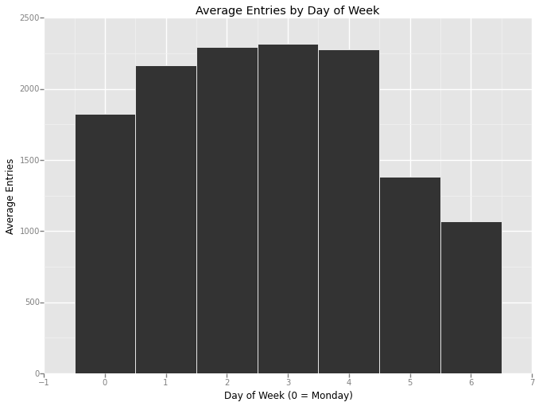
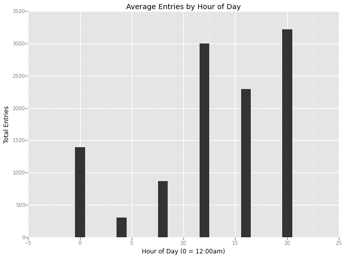
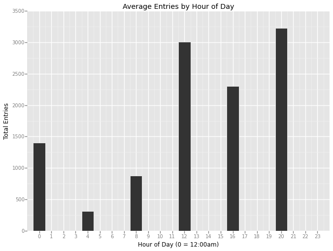

```python
from IPython.display import HTML

HTML('''<script>
code_show=true; 
function code_toggle() {
 if (code_show){
 $('div.input').hide();
 } else {
 $('div.input').show();
 }
 code_show = !code_show
} 
$( document ).ready(code_toggle);
</script>
<form action="javascript:code_toggle()"><input type="submit" value="Click here to toggle on/off the raw code."></form>''')
```


<script>
code_show=true; 
function code_toggle() {
 if (code_show){
 $('div.input').hide();
 } else {
 $('div.input').show();
 }
 code_show = !code_show
} 
$( document ).ready(code_toggle);
</script>
<form action="javascript:code_toggle()"><input type="submit" value="Click here to toggle on/off the raw code."></form>


#Data Analyst Nanodegree
##Project 2: Analyzing the NYC Subway Dataset

###Section 1. Statistical Test

####1.1 Which statistical test did you use to analyze the NYC subway data? Did you use a one-tail or a two-tail P value? What is the null hypothesis? What is your p-critical value?

####1.2 Why is this statistical test applicable to the dataset? In particular, consider the assumptions that the test is making about the distribution of ridership in the two samples. 

The Mann-Whitney U-test was used to compare the ridership of rainy days vs non-rainy days. This test is suitable as 1) the underlying distributions are not normally distributed, and 2) the Mann-Whitney U-test is a non-parametric test which does not assume any particular distribution, as opposed to Welch’s t-test.

A two-tailed test and hence a two-tailed P value was used. A two-tailed test is suitable as such a test is able to establish whether either of the two distributions tends to have greater/lessor values than the other.

The two-tailed P value for this test is .05 (5% significance level).

Null Hypothesis: There 'is no significant difference' between the distribution of ridership on rainy days compared to the distribution of ridership on non-rainy days.

Alternative Hypothesis: There 'is a significant difference' between the distribution of ridership on rainy days compared to the distribution of ridership on non-rainy days.

Therefore, if (p * 2) < 0.05, we reject the null hypothesis.

Do note that as the sample size is > ~20, U is assumed to be approximately normally distributed and as such, U was found by employing 'method two' discussed here: https://en.wikipedia.org/wiki/Mann%E2%80%93Whitney_U_test).


```python
import pandas as pd
import numpy as np
import scipy.stats
```


```python
path = r'data\turnstile_weather_v2.csv'
dataFrame = pd.read_csv(path)
dataFrame.head(5)
```


<div>
<table border="1" class="dataframe">
  <thead>
    <tr style="text-align: right;">
      <th></th>
      <th>UNIT</th>
      <th>DATEn</th>
      <th>TIMEn</th>
      <th>ENTRIESn</th>
      <th>EXITSn</th>
      <th>ENTRIESn_hourly</th>
      <th>EXITSn_hourly</th>
      <th>datetime</th>
      <th>hour</th>
      <th>day_week</th>
      <th>...</th>
      <th>pressurei</th>
      <th>rain</th>
      <th>tempi</th>
      <th>wspdi</th>
      <th>meanprecipi</th>
      <th>meanpressurei</th>
      <th>meantempi</th>
      <th>meanwspdi</th>
      <th>weather_lat</th>
      <th>weather_lon</th>
    </tr>
  </thead>
  <tbody>
    <tr>
      <th>0</th>
      <td>R003</td>
      <td>05-01-11</td>
      <td>00:00:00</td>
      <td>4388333</td>
      <td>2911002</td>
      <td>0</td>
      <td>0</td>
      <td>2011-05-01 00:00:00</td>
      <td>0</td>
      <td>6</td>
      <td>...</td>
      <td>30.22</td>
      <td>0</td>
      <td>55.9</td>
      <td>3.5</td>
      <td>0</td>
      <td>30.258</td>
      <td>55.98</td>
      <td>7.86</td>
      <td>40.700348</td>
      <td>-73.887177</td>
    </tr>
    <tr>
      <th>1</th>
      <td>R003</td>
      <td>05-01-11</td>
      <td>04:00:00</td>
      <td>4388333</td>
      <td>2911002</td>
      <td>0</td>
      <td>0</td>
      <td>2011-05-01 04:00:00</td>
      <td>4</td>
      <td>6</td>
      <td>...</td>
      <td>30.25</td>
      <td>0</td>
      <td>52.0</td>
      <td>3.5</td>
      <td>0</td>
      <td>30.258</td>
      <td>55.98</td>
      <td>7.86</td>
      <td>40.700348</td>
      <td>-73.887177</td>
    </tr>
    <tr>
      <th>2</th>
      <td>R003</td>
      <td>05-01-11</td>
      <td>12:00:00</td>
      <td>4388333</td>
      <td>2911002</td>
      <td>0</td>
      <td>0</td>
      <td>2011-05-01 12:00:00</td>
      <td>12</td>
      <td>6</td>
      <td>...</td>
      <td>30.28</td>
      <td>0</td>
      <td>62.1</td>
      <td>6.9</td>
      <td>0</td>
      <td>30.258</td>
      <td>55.98</td>
      <td>7.86</td>
      <td>40.700348</td>
      <td>-73.887177</td>
    </tr>
    <tr>
      <th>3</th>
      <td>R003</td>
      <td>05-01-11</td>
      <td>16:00:00</td>
      <td>4388333</td>
      <td>2911002</td>
      <td>0</td>
      <td>0</td>
      <td>2011-05-01 16:00:00</td>
      <td>16</td>
      <td>6</td>
      <td>...</td>
      <td>30.26</td>
      <td>0</td>
      <td>57.9</td>
      <td>15.0</td>
      <td>0</td>
      <td>30.258</td>
      <td>55.98</td>
      <td>7.86</td>
      <td>40.700348</td>
      <td>-73.887177</td>
    </tr>
    <tr>
      <th>4</th>
      <td>R003</td>
      <td>05-01-11</td>
      <td>20:00:00</td>
      <td>4388333</td>
      <td>2911002</td>
      <td>0</td>
      <td>0</td>
      <td>2011-05-01 20:00:00</td>
      <td>20</td>
      <td>6</td>
      <td>...</td>
      <td>30.28</td>
      <td>0</td>
      <td>52.0</td>
      <td>10.4</td>
      <td>0</td>
      <td>30.258</td>
      <td>55.98</td>
      <td>7.86</td>
      <td>40.700348</td>
      <td>-73.887177</td>
    </tr>
  </tbody>
</table>
<p>5 rows × 27 columns</p>
</div>


```python
df_rain = dataFrame[dataFrame.rain != 0]
df_norain = dataFrame[dataFrame.rain == 0]

df_rainent = df_rain['ENTRIESn_hourly']
df_norainent = df_norain['ENTRIESn_hourly']
```

####1.3 What results did you get from this statistical test? These should include the following numerical values: p-values, as well as the means for each of the two samples under test. 

####1.4 What is the significance and interpretation of these results?


```python
print "Mean ridership for rain group:"
df_rainent.mean()
```

    Mean ridership for rain group:
    


    2028.1960354720918


```python
print "Standard deviation of ridership for rain group:"
df_rainent.std()
```

    Standard deviation of ridership for rain group:
    


    3189.4333728816387


```python
print "Mean ridership for non-rain group:"
df_norainent.mean()
```

    Mean ridership for non-rain group:
    


    1845.5394386644084


```python
print "Standard deviation of ridership for non-rain group:"
df_norainent.std()
```

    Standard deviation of ridership for non-rain group:
    


    2878.7708479755574


The mean ridership for the rain group is higher than the non-rain group, however ridership datapoints for the rain group also have greater standard deviation than the non-rain group. Below forms the test for statistically significant difference between the distribution of ridership between the two groups.


```python
n = len(df_rain)

print "Number of observations with rain:"
n
```

    Number of observations with rain:
    


    9585


```python
n = len(df_norain)

print "Number of observations without rain:"
n
```

    Number of observations without rain:
    


    33064


```python
U,p = scipy.stats.mannwhitneyu(df_rainent, df_norainent)
m_u = (len(df_rainent) * len(df_norainent)) / 2
sigma_u = np.sqrt(len(df_rainent) * len(df_norainent) * (len(df_rainent) + len(df_norainent) + 1) / 12)
z = (U - m_u) / sigma_u
p = 2 * scipy.stats.norm.cdf(z)

print "Mann-Whitney U-test statistic:"
p
```

    Mann-Whitney U-test statistic:
    


    5.4826938714192724e-06


We reject the null hypothesis that there 'is no significant difference' between the distribution of ridership on rainy days compared to the distribution of ridership on non-rainy days. We reject the null hypothesis at the 5% significance level. (5.48e-06 < 0.05). Note that we also found mean ridership of the rain group to be higher than the non-rain group as part of the descriptive statistics reported above. 

###Section 2. Linear Regression

####2.1 What approach did you use to compute the coefficients theta and produce prediction for ENTRIESn_hourly in your regression model: OLS using Statsmodels or Scikit Learn, Gradient descent using Scikit Learn, Or something different?

####2.2 What features (input variables) did you use in your model? Did you use any dummy variables as part of your features?

####2.3 Why did you select these features in your model? We are looking for specific reasons that lead you to believe that the selected features will contribute to the predictive power of your model. 

Ordinary Least Squares (OLS) (using Statsmodels) was used to compute the coefficients theta and produce prediction for ENTRIESn_hourly (hourly number of entries). Two models were considered, one with and one without weather features: 'rain', 'fog' and 'tempi'.

OLS_noweather: features included based on the expectation that:
1) 'hour': ridership varies based on the time of day (peak vs. non-peak transit hours).
2) 'weekday': ridership varies based on weekdays vs. weekends (business vs. leisure transit).
3) 'UNIT': there is a disparity between stations average ridership due to (for example) whether the station is located in a heavy/less populated area. (UNIT feature is a transformed dummy variable to account for higher/lower trafficked units.) 

OLS_weather: features included based on the expectation that:
1) 'hour': ridership varies based on the time of day (peak vs. non-peak transit hours).
2) 'weekday': ridership varies based on weekdays vs. weekends (business vs. leisure transit).
3) 'rain': ridership varies based on whether it has rained that day.
4) 'fog': ridership varies based on whether there is fog.
5) 'tempi': ridership varies based on temperature.
6) 'UNIT': there is a disparity between stations average ridership due to (for example) whether the station is located in a heavy/less populated area. (UNIT feature is a transformed dummy variable to account for higher/lower trafficked units.)


```python
import pandas as pd
import numpy as np
import statsmodels.api as sm
import matplotlib.pyplot as plt
%matplotlib inline
```


```python
path = r'data\turnstile_weather_v2.csv'
dataFrame = pd.read_csv(path)
```


```python
y = dataFrame['ENTRIESn_hourly']

x_noweather = dataFrame[['hour', 'weekday']]
x_weather = dataFrame[['hour', 'weekday', 'rain', 'fog', 'tempi']]

unit_dum = pd.get_dummies(dataFrame['UNIT'], prefix = 'unit')
x_noweather = x_noweather.join(unit_dum)
x_weather = x_weather.join(unit_dum)
```


```python
fit_noweather = sm.OLS(y, x_noweather).fit()
fit_weather = sm.OLS(y, x_weather).fit()
```

###2.4 What are the parameters (also known as "coefficients" or "weights") of the non-dummy features in your linear regression model?

###2.5 What is your model’s R2 (coefficients of determination) value?


```python
#fit_noweather.rsquared
fit_noweather.summary()
```


<table class="simpletable">
<caption>OLS Regression Results</caption>
<tr>
  <th>Dep. Variable:</th>     <td>ENTRIESn_hourly</td> <th>  R-squared:         </th>  <td>   0.481</td>  
</tr>
<tr>
  <th>Model:</th>                   <td>OLS</td>       <th>  Adj. R-squared:    </th>  <td>   0.478</td>  
</tr>
<tr>
  <th>Method:</th>             <td>Least Squares</td>  <th>  F-statistic:       </th>  <td>   163.3</td>  
</tr>
<tr>
  <th>Date:</th>             <td>Wed, 09 Sep 2015</td> <th>  Prob (F-statistic):</th>   <td>  0.00</td>   
</tr>
<tr>
  <th>Time:</th>                 <td>20:11:48</td>     <th>  Log-Likelihood:    </th> <td>-3.8730e+05</td>
</tr>
<tr>
  <th>No. Observations:</th>      <td> 42649</td>      <th>  AIC:               </th>  <td>7.751e+05</td> 
</tr>
<tr>
  <th>Df Residuals:</th>          <td> 42407</td>      <th>  BIC:               </th>  <td>7.772e+05</td> 
</tr>
<tr>
  <th>Df Model:</th>              <td>   241</td>      <th>                     </th>      <td> </td>     
</tr>
<tr>
  <th>Covariance Type:</th>      <td>nonrobust</td>    <th>                     </th>      <td> </td>     
</tr>
</table>
<table class="simpletable">
<tr>
      <td></td>         <th>coef</th>     <th>std err</th>      <th>t</th>      <th>P>|t|</th> <th>[95.0% Conf. Int.]</th> 
</tr>
<tr>
  <th>hour</th>      <td>  123.3863</td> <td>    1.488</td> <td>   82.918</td> <td> 0.000</td> <td>  120.470   126.303</td>
</tr>
<tr>
  <th>weekday</th>   <td>  981.3665</td> <td>   22.863</td> <td>   42.924</td> <td> 0.000</td> <td>  936.555  1026.178</td>
</tr>
<tr>
  <th>unit_R003</th> <td>-1735.2256</td> <td>  166.029</td> <td>  -10.451</td> <td> 0.000</td> <td>-2060.647 -1409.805</td>
</tr>
<tr>
  <th>unit_R004</th> <td>-1401.6229</td> <td>  162.734</td> <td>   -8.613</td> <td> 0.000</td> <td>-1720.584 -1082.662</td>
</tr>
<tr>
  <th>unit_R005</th> <td>-1401.3884</td> <td>  164.104</td> <td>   -8.540</td> <td> 0.000</td> <td>-1723.035 -1079.742</td>
</tr>
<tr>
  <th>unit_R006</th> <td>-1283.9222</td> <td>  160.427</td> <td>   -8.003</td> <td> 0.000</td> <td>-1598.362  -969.482</td>
</tr>
<tr>
  <th>unit_R007</th> <td>-1570.5069</td> <td>  165.051</td> <td>   -9.515</td> <td> 0.000</td> <td>-1894.011 -1247.003</td>
</tr>
<tr>
  <th>unit_R008</th> <td>-1561.9768</td> <td>  165.565</td> <td>   -9.434</td> <td> 0.000</td> <td>-1886.487 -1237.467</td>
</tr>
<tr>
  <th>unit_R009</th> <td>-1614.2520</td> <td>  162.717</td> <td>   -9.921</td> <td> 0.000</td> <td>-1933.181 -1295.323</td>
</tr>
<tr>
  <th>unit_R011</th> <td> 5426.2351</td> <td>  158.753</td> <td>   34.180</td> <td> 0.000</td> <td> 5115.076  5737.395</td>
</tr>
<tr>
  <th>unit_R012</th> <td> 6770.0165</td> <td>  157.893</td> <td>   42.877</td> <td> 0.000</td> <td> 6460.543  7079.490</td>
</tr>
<tr>
  <th>unit_R013</th> <td>  668.4574</td> <td>  157.893</td> <td>    4.234</td> <td> 0.000</td> <td>  358.984   977.931</td>
</tr>
<tr>
  <th>unit_R016</th> <td>-1143.4932</td> <td>  158.753</td> <td>   -7.203</td> <td> 0.000</td> <td>-1454.653  -832.334</td>
</tr>
<tr>
  <th>unit_R017</th> <td> 2283.4520</td> <td>  157.893</td> <td>   14.462</td> <td> 0.000</td> <td> 1973.979  2592.925</td>
</tr>
<tr>
  <th>unit_R018</th> <td> 5873.0658</td> <td>  158.321</td> <td>   37.096</td> <td> 0.000</td> <td> 5562.753  6183.379</td>
</tr>
<tr>
  <th>unit_R019</th> <td> 1337.3445</td> <td>  157.893</td> <td>    8.470</td> <td> 0.000</td> <td> 1027.871  1646.818</td>
</tr>
<tr>
  <th>unit_R020</th> <td> 4459.5488</td> <td>  157.893</td> <td>   28.244</td> <td> 0.000</td> <td> 4150.076  4769.022</td>
</tr>
<tr>
  <th>unit_R021</th> <td> 2780.5306</td> <td>  158.740</td> <td>   17.516</td> <td> 0.000</td> <td> 2469.396  3091.665</td>
</tr>
<tr>
  <th>unit_R022</th> <td> 7603.9413</td> <td>  157.893</td> <td>   48.159</td> <td> 0.000</td> <td> 7294.468  7913.414</td>
</tr>
<tr>
  <th>unit_R023</th> <td> 4239.1187</td> <td>  157.893</td> <td>   26.848</td> <td> 0.000</td> <td> 3929.646  4548.592</td>
</tr>
<tr>
  <th>unit_R024</th> <td> 1303.8029</td> <td>  158.309</td> <td>    8.236</td> <td> 0.000</td> <td>  993.515  1614.091</td>
</tr>
<tr>
  <th>unit_R025</th> <td> 3434.2370</td> <td>  157.893</td> <td>   21.750</td> <td> 0.000</td> <td> 3124.764  3743.710</td>
</tr>
<tr>
  <th>unit_R027</th> <td> 1053.5542</td> <td>  157.893</td> <td>    6.673</td> <td> 0.000</td> <td>  744.081  1363.027</td>
</tr>
<tr>
  <th>unit_R029</th> <td> 5315.5273</td> <td>  157.893</td> <td>   33.665</td> <td> 0.000</td> <td> 5006.054  5625.000</td>
</tr>
<tr>
  <th>unit_R030</th> <td> 1185.7208</td> <td>  157.893</td> <td>    7.510</td> <td> 0.000</td> <td>  876.248  1495.194</td>
</tr>
<tr>
  <th>unit_R031</th> <td> 2437.4897</td> <td>  157.893</td> <td>   15.438</td> <td> 0.000</td> <td> 2128.016  2746.963</td>
</tr>
<tr>
  <th>unit_R032</th> <td> 2536.5326</td> <td>  158.309</td> <td>   16.023</td> <td> 0.000</td> <td> 2226.245  2846.821</td>
</tr>
<tr>
  <th>unit_R033</th> <td> 6320.5004</td> <td>  157.893</td> <td>   40.030</td> <td> 0.000</td> <td> 6011.027  6629.974</td>
</tr>
<tr>
  <th>unit_R034</th> <td> -732.8214</td> <td>  165.106</td> <td>   -4.438</td> <td> 0.000</td> <td>-1056.432  -409.211</td>
</tr>
<tr>
  <th>unit_R035</th> <td>  891.2460</td> <td>  158.753</td> <td>    5.614</td> <td> 0.000</td> <td>  580.086  1202.406</td>
</tr>
<tr>
  <th>unit_R036</th> <td>-1138.9980</td> <td>  161.826</td> <td>   -7.038</td> <td> 0.000</td> <td>-1456.181  -821.815</td>
</tr>
<tr>
  <th>unit_R037</th> <td>-1053.2559</td> <td>  159.157</td> <td>   -6.618</td> <td> 0.000</td> <td>-1365.206  -741.305</td>
</tr>
<tr>
  <th>unit_R038</th> <td>-1689.7459</td> <td>  162.703</td> <td>  -10.385</td> <td> 0.000</td> <td>-2008.648 -1370.844</td>
</tr>
<tr>
  <th>unit_R039</th> <td>-1121.3100</td> <td>  167.060</td> <td>   -6.712</td> <td> 0.000</td> <td>-1448.751  -793.869</td>
</tr>
<tr>
  <th>unit_R040</th> <td> -651.8770</td> <td>  158.740</td> <td>   -4.107</td> <td> 0.000</td> <td> -963.011  -340.743</td>
</tr>
<tr>
  <th>unit_R041</th> <td> 1185.5327</td> <td>  157.893</td> <td>    7.508</td> <td> 0.000</td> <td>  876.060  1495.006</td>
</tr>
<tr>
  <th>unit_R042</th> <td>-1300.7440</td> <td>  160.465</td> <td>   -8.106</td> <td> 0.000</td> <td>-1615.258  -986.230</td>
</tr>
<tr>
  <th>unit_R043</th> <td>  972.6671</td> <td>  157.893</td> <td>    6.160</td> <td> 0.000</td> <td>  663.194  1282.140</td>
</tr>
<tr>
  <th>unit_R044</th> <td> 2764.0757</td> <td>  157.893</td> <td>   17.506</td> <td> 0.000</td> <td> 2454.603  3073.549</td>
</tr>
<tr>
  <th>unit_R046</th> <td> 6430.5273</td> <td>  157.893</td> <td>   40.727</td> <td> 0.000</td> <td> 6121.054  6740.000</td>
</tr>
<tr>
  <th>unit_R049</th> <td>  858.3391</td> <td>  157.893</td> <td>    5.436</td> <td> 0.000</td> <td>  548.866  1167.812</td>
</tr>
<tr>
  <th>unit_R050</th> <td> 2113.3562</td> <td>  158.725</td> <td>   13.315</td> <td> 0.000</td> <td> 1802.253  2424.460</td>
</tr>
<tr>
  <th>unit_R051</th> <td> 3220.0811</td> <td>  157.893</td> <td>   20.394</td> <td> 0.000</td> <td> 2910.608  3529.554</td>
</tr>
<tr>
  <th>unit_R052</th> <td> -650.3900</td> <td>  164.111</td> <td>   -3.963</td> <td> 0.000</td> <td> -972.050  -328.730</td>
</tr>
<tr>
  <th>unit_R053</th> <td> 1272.4416</td> <td>  158.753</td> <td>    8.015</td> <td> 0.000</td> <td>  961.282  1583.601</td>
</tr>
<tr>
  <th>unit_R054</th> <td> -445.3716</td> <td>  158.740</td> <td>   -2.806</td> <td> 0.005</td> <td> -756.506  -134.237</td>
</tr>
<tr>
  <th>unit_R055</th> <td> 6428.8553</td> <td>  157.893</td> <td>   40.717</td> <td> 0.000</td> <td> 6119.382  6738.328</td>
</tr>
<tr>
  <th>unit_R056</th> <td> -460.6997</td> <td>  158.753</td> <td>   -2.902</td> <td> 0.004</td> <td> -771.859  -149.540</td>
</tr>
<tr>
  <th>unit_R057</th> <td> 2968.4682</td> <td>  157.893</td> <td>   18.801</td> <td> 0.000</td> <td> 2658.995  3277.941</td>
</tr>
<tr>
  <th>unit_R058</th> <td>-1267.9214</td> <td>  158.309</td> <td>   -8.009</td> <td> 0.000</td> <td>-1578.209  -957.634</td>
</tr>
<tr>
  <th>unit_R059</th> <td> -699.7078</td> <td>  161.790</td> <td>   -4.325</td> <td> 0.000</td> <td>-1016.820  -382.595</td>
</tr>
<tr>
  <th>unit_R060</th> <td>-1094.9682</td> <td>  160.478</td> <td>   -6.823</td> <td> 0.000</td> <td>-1409.508  -780.428</td>
</tr>
<tr>
  <th>unit_R061</th> <td>-1261.3081</td> <td>  166.515</td> <td>   -7.575</td> <td> 0.000</td> <td>-1587.680  -934.936</td>
</tr>
<tr>
  <th>unit_R062</th> <td>  822.3284</td> <td>  157.893</td> <td>    5.208</td> <td> 0.000</td> <td>  512.855  1131.802</td>
</tr>
<tr>
  <th>unit_R063</th> <td> -699.4696</td> <td>  165.995</td> <td>   -4.214</td> <td> 0.000</td> <td>-1024.824  -374.115</td>
</tr>
<tr>
  <th>unit_R064</th> <td>-1050.8383</td> <td>  162.242</td> <td>   -6.477</td> <td> 0.000</td> <td>-1368.837  -732.840</td>
</tr>
<tr>
  <th>unit_R065</th> <td>-1021.1886</td> <td>  164.090</td> <td>   -6.223</td> <td> 0.000</td> <td>-1342.809  -699.568</td>
</tr>
<tr>
  <th>unit_R066</th> <td>-1607.0711</td> <td>  165.068</td> <td>   -9.736</td> <td> 0.000</td> <td>-1930.608 -1283.535</td>
</tr>
<tr>
  <th>unit_R067</th> <td> -992.4447</td> <td>  166.491</td> <td>   -5.961</td> <td> 0.000</td> <td>-1318.770  -666.120</td>
</tr>
<tr>
  <th>unit_R068</th> <td>-1383.3695</td> <td>  166.487</td> <td>   -8.309</td> <td> 0.000</td> <td>-1709.688 -1057.051</td>
</tr>
<tr>
  <th>unit_R069</th> <td> -924.5812</td> <td>  163.647</td> <td>   -5.650</td> <td> 0.000</td> <td>-1245.332  -603.831</td>
</tr>
<tr>
  <th>unit_R070</th> <td> -126.6931</td> <td>  157.893</td> <td>   -0.802</td> <td> 0.422</td> <td> -436.166   182.780</td>
</tr>
<tr>
  <th>unit_R080</th> <td> 1697.6348</td> <td>  157.893</td> <td>   10.752</td> <td> 0.000</td> <td> 1388.162  2007.108</td>
</tr>
<tr>
  <th>unit_R081</th> <td> 1649.7104</td> <td>  158.712</td> <td>   10.394</td> <td> 0.000</td> <td> 1338.631  1960.790</td>
</tr>
<tr>
  <th>unit_R082</th> <td> -401.3444</td> <td>  158.740</td> <td>   -2.528</td> <td> 0.011</td> <td> -712.479   -90.210</td>
</tr>
<tr>
  <th>unit_R083</th> <td> 1212.0434</td> <td>  157.893</td> <td>    7.676</td> <td> 0.000</td> <td>  902.570  1521.517</td>
</tr>
<tr>
  <th>unit_R084</th> <td> 8116.3176</td> <td>  157.893</td> <td>   51.404</td> <td> 0.000</td> <td> 7806.844  8425.791</td>
</tr>
<tr>
  <th>unit_R085</th> <td>  705.1492</td> <td>  158.731</td> <td>    4.442</td> <td> 0.000</td> <td>  394.034  1016.265</td>
</tr>
<tr>
  <th>unit_R086</th> <td>  685.6348</td> <td>  157.893</td> <td>    4.342</td> <td> 0.000</td> <td>  376.162   995.108</td>
</tr>
<tr>
  <th>unit_R087</th> <td> -669.0175</td> <td>  159.615</td> <td>   -4.191</td> <td> 0.000</td> <td> -981.866  -356.169</td>
</tr>
<tr>
  <th>unit_R089</th> <td>-1389.7051</td> <td>  158.753</td> <td>   -8.754</td> <td> 0.000</td> <td>-1700.865 -1078.546</td>
</tr>
<tr>
  <th>unit_R090</th> <td>-1441.5563</td> <td>  166.465</td> <td>   -8.660</td> <td> 0.000</td> <td>-1767.831 -1115.282</td>
</tr>
<tr>
  <th>unit_R091</th> <td> -737.2775</td> <td>  165.051</td> <td>   -4.467</td> <td> 0.000</td> <td>-1060.781  -413.774</td>
</tr>
<tr>
  <th>unit_R092</th> <td>  119.5620</td> <td>  162.223</td> <td>    0.737</td> <td> 0.461</td> <td> -198.399   437.523</td>
</tr>
<tr>
  <th>unit_R093</th> <td>  149.0470</td> <td>  163.174</td> <td>    0.913</td> <td> 0.361</td> <td> -170.777   468.871</td>
</tr>
<tr>
  <th>unit_R094</th> <td> -127.5490</td> <td>  158.728</td> <td>   -0.804</td> <td> 0.422</td> <td> -438.658   183.560</td>
</tr>
<tr>
  <th>unit_R095</th> <td>  287.2310</td> <td>  160.041</td> <td>    1.795</td> <td> 0.073</td> <td>  -26.453   600.915</td>
</tr>
<tr>
  <th>unit_R096</th> <td>  460.9867</td> <td>  158.309</td> <td>    2.912</td> <td> 0.004</td> <td>  150.699   771.275</td>
</tr>
<tr>
  <th>unit_R097</th> <td> 1082.1036</td> <td>  158.321</td> <td>    6.835</td> <td> 0.000</td> <td>  771.791  1392.417</td>
</tr>
<tr>
  <th>unit_R098</th> <td>  -79.8060</td> <td>  157.893</td> <td>   -0.505</td> <td> 0.613</td> <td> -389.279   229.667</td>
</tr>
<tr>
  <th>unit_R099</th> <td>  477.2208</td> <td>  157.893</td> <td>    3.022</td> <td> 0.003</td> <td>  167.748   786.694</td>
</tr>
<tr>
  <th>unit_R100</th> <td>-1328.5460</td> <td>  159.561</td> <td>   -8.326</td> <td> 0.000</td> <td>-1641.289 -1015.803</td>
</tr>
<tr>
  <th>unit_R101</th> <td>  911.6133</td> <td>  157.893</td> <td>    5.774</td> <td> 0.000</td> <td>  602.140  1221.086</td>
</tr>
<tr>
  <th>unit_R102</th> <td> 1800.4520</td> <td>  157.893</td> <td>   11.403</td> <td> 0.000</td> <td> 1490.979  2109.925</td>
</tr>
<tr>
  <th>unit_R103</th> <td> -454.2394</td> <td>  164.049</td> <td>   -2.769</td> <td> 0.006</td> <td> -775.778  -132.700</td>
</tr>
<tr>
  <th>unit_R104</th> <td> -538.5564</td> <td>  158.740</td> <td>   -3.393</td> <td> 0.001</td> <td> -849.691  -227.422</td>
</tr>
<tr>
  <th>unit_R105</th> <td> 1450.1510</td> <td>  157.893</td> <td>    9.184</td> <td> 0.000</td> <td> 1140.678  1759.624</td>
</tr>
<tr>
  <th>unit_R106</th> <td> -732.8835</td> <td>  166.545</td> <td>   -4.401</td> <td> 0.000</td> <td>-1059.314  -406.453</td>
</tr>
<tr>
  <th>unit_R107</th> <td>-1322.8411</td> <td>  167.014</td> <td>   -7.921</td> <td> 0.000</td> <td>-1650.192  -995.490</td>
</tr>
<tr>
  <th>unit_R108</th> <td> 3339.3176</td> <td>  157.893</td> <td>   21.149</td> <td> 0.000</td> <td> 3029.844  3648.791</td>
</tr>
<tr>
  <th>unit_R111</th> <td> 1336.4413</td> <td>  157.893</td> <td>    8.464</td> <td> 0.000</td> <td> 1026.968  1645.914</td>
</tr>
<tr>
  <th>unit_R112</th> <td> -197.3268</td> <td>  158.309</td> <td>   -1.246</td> <td> 0.213</td> <td> -507.615   112.961</td>
</tr>
<tr>
  <th>unit_R114</th> <td> -992.2428</td> <td>  158.306</td> <td>   -6.268</td> <td> 0.000</td> <td>-1302.525  -681.961</td>
</tr>
<tr>
  <th>unit_R115</th> <td> -615.1662</td> <td>  157.893</td> <td>   -3.896</td> <td> 0.000</td> <td> -924.639  -305.693</td>
</tr>
<tr>
  <th>unit_R116</th> <td> 1315.5864</td> <td>  157.893</td> <td>    8.332</td> <td> 0.000</td> <td> 1006.113  1625.060</td>
</tr>
<tr>
  <th>unit_R117</th> <td> -947.7289</td> <td>  166.033</td> <td>   -5.708</td> <td> 0.000</td> <td>-1273.156  -622.302</td>
</tr>
<tr>
  <th>unit_R119</th> <td>    2.9878</td> <td>  160.928</td> <td>    0.019</td> <td> 0.985</td> <td> -312.434   318.410</td>
</tr>
<tr>
  <th>unit_R120</th> <td> -334.8427</td> <td>  163.151</td> <td>   -2.052</td> <td> 0.040</td> <td> -654.621   -15.064</td>
</tr>
<tr>
  <th>unit_R121</th> <td> -378.1694</td> <td>  162.261</td> <td>   -2.331</td> <td> 0.020</td> <td> -696.205   -60.134</td>
</tr>
<tr>
  <th>unit_R122</th> <td>  703.9809</td> <td>  159.994</td> <td>    4.400</td> <td> 0.000</td> <td>  390.390  1017.572</td>
</tr>
<tr>
  <th>unit_R123</th> <td> -235.3177</td> <td>  160.472</td> <td>   -1.466</td> <td> 0.143</td> <td> -549.845    79.210</td>
</tr>
<tr>
  <th>unit_R124</th> <td>-1178.0271</td> <td>  164.579</td> <td>   -7.158</td> <td> 0.000</td> <td>-1500.605  -855.449</td>
</tr>
<tr>
  <th>unit_R126</th> <td>  -22.5050</td> <td>  157.893</td> <td>   -0.143</td> <td> 0.887</td> <td> -331.978   286.968</td>
</tr>
<tr>
  <th>unit_R127</th> <td> 2918.2047</td> <td>  157.893</td> <td>   18.482</td> <td> 0.000</td> <td> 2608.732  3227.678</td>
</tr>
<tr>
  <th>unit_R137</th> <td>  574.7639</td> <td>  157.893</td> <td>    3.640</td> <td> 0.000</td> <td>  265.291   884.237</td>
</tr>
<tr>
  <th>unit_R139</th> <td>  657.8766</td> <td>  158.321</td> <td>    4.155</td> <td> 0.000</td> <td>  347.564   968.189</td>
</tr>
<tr>
  <th>unit_R163</th> <td> 1453.9413</td> <td>  157.893</td> <td>    9.208</td> <td> 0.000</td> <td> 1144.468  1763.414</td>
</tr>
<tr>
  <th>unit_R172</th> <td>   19.9789</td> <td>  157.893</td> <td>    0.127</td> <td> 0.899</td> <td> -289.494   329.452</td>
</tr>
<tr>
  <th>unit_R179</th> <td> 4900.7531</td> <td>  157.893</td> <td>   31.038</td> <td> 0.000</td> <td> 4591.280  5210.226</td>
</tr>
<tr>
  <th>unit_R181</th> <td>  -84.9076</td> <td>  160.902</td> <td>   -0.528</td> <td> 0.598</td> <td> -400.278   230.463</td>
</tr>
<tr>
  <th>unit_R183</th> <td>-1035.1812</td> <td>  167.011</td> <td>   -6.198</td> <td> 0.000</td> <td>-1362.526  -707.837</td>
</tr>
<tr>
  <th>unit_R184</th> <td> -811.4363</td> <td>  165.074</td> <td>   -4.916</td> <td> 0.000</td> <td>-1134.985  -487.887</td>
</tr>
<tr>
  <th>unit_R186</th> <td> -775.4586</td> <td>  160.019</td> <td>   -4.846</td> <td> 0.000</td> <td>-1089.098  -461.819</td>
</tr>
<tr>
  <th>unit_R188</th> <td>  458.2353</td> <td>  158.309</td> <td>    2.895</td> <td> 0.004</td> <td>  147.947   768.523</td>
</tr>
<tr>
  <th>unit_R189</th> <td> -441.6081</td> <td>  161.826</td> <td>   -2.729</td> <td> 0.006</td> <td> -758.791  -124.426</td>
</tr>
<tr>
  <th>unit_R194</th> <td>  145.2285</td> <td>  160.899</td> <td>    0.903</td> <td> 0.367</td> <td> -170.137   460.594</td>
</tr>
<tr>
  <th>unit_R196</th> <td> -533.8247</td> <td>  159.163</td> <td>   -3.354</td> <td> 0.001</td> <td> -845.787  -221.862</td>
</tr>
<tr>
  <th>unit_R198</th> <td>  247.1338</td> <td>  158.740</td> <td>    1.557</td> <td> 0.120</td> <td>  -64.001   558.268</td>
</tr>
<tr>
  <th>unit_R199</th> <td>-1130.4256</td> <td>  160.905</td> <td>   -7.025</td> <td> 0.000</td> <td>-1445.804  -815.048</td>
</tr>
<tr>
  <th>unit_R200</th> <td> -800.6084</td> <td>  159.596</td> <td>   -5.016</td> <td> 0.000</td> <td>-1113.419  -487.798</td>
</tr>
<tr>
  <th>unit_R202</th> <td>  360.1072</td> <td>  158.712</td> <td>    2.269</td> <td> 0.023</td> <td>   49.028   671.187</td>
</tr>
<tr>
  <th>unit_R203</th> <td>  -74.1720</td> <td>  162.717</td> <td>   -0.456</td> <td> 0.649</td> <td> -393.101   244.757</td>
</tr>
<tr>
  <th>unit_R204</th> <td> -418.5211</td> <td>  157.893</td> <td>   -2.651</td> <td> 0.008</td> <td> -727.994  -109.048</td>
</tr>
<tr>
  <th>unit_R205</th> <td> -346.5984</td> <td>  159.608</td> <td>   -2.172</td> <td> 0.030</td> <td> -659.434   -33.763</td>
</tr>
<tr>
  <th>unit_R207</th> <td>  135.5488</td> <td>  158.309</td> <td>    0.856</td> <td> 0.392</td> <td> -174.739   445.837</td>
</tr>
<tr>
  <th>unit_R208</th> <td>  663.0799</td> <td>  159.589</td> <td>    4.155</td> <td> 0.000</td> <td>  350.282   975.878</td>
</tr>
<tr>
  <th>unit_R209</th> <td>-1010.5881</td> <td>  166.012</td> <td>   -6.087</td> <td> 0.000</td> <td>-1335.975  -685.201</td>
</tr>
<tr>
  <th>unit_R210</th> <td>-1297.6230</td> <td>  161.813</td> <td>   -8.019</td> <td> 0.000</td> <td>-1614.780  -980.466</td>
</tr>
<tr>
  <th>unit_R211</th> <td>  538.9090</td> <td>  157.893</td> <td>    3.413</td> <td> 0.001</td> <td>  229.436   848.382</td>
</tr>
<tr>
  <th>unit_R212</th> <td> -175.1667</td> <td>  158.321</td> <td>   -1.106</td> <td> 0.269</td> <td> -485.480   135.146</td>
</tr>
<tr>
  <th>unit_R213</th> <td> -680.0695</td> <td>  161.355</td> <td>   -4.215</td> <td> 0.000</td> <td> -996.329  -363.810</td>
</tr>
<tr>
  <th>unit_R214</th> <td>-1135.6793</td> <td>  166.515</td> <td>   -6.820</td> <td> 0.000</td> <td>-1462.051  -809.307</td>
</tr>
<tr>
  <th>unit_R215</th> <td> -263.0376</td> <td>  158.743</td> <td>   -1.657</td> <td> 0.098</td> <td> -574.178    48.103</td>
</tr>
<tr>
  <th>unit_R216</th> <td>-1092.7283</td> <td>  158.728</td> <td>   -6.884</td> <td> 0.000</td> <td>-1403.838  -781.619</td>
</tr>
<tr>
  <th>unit_R217</th> <td> -810.0086</td> <td>  166.009</td> <td>   -4.879</td> <td> 0.000</td> <td>-1135.390  -484.627</td>
</tr>
<tr>
  <th>unit_R218</th> <td>  125.4894</td> <td>  158.309</td> <td>    0.793</td> <td> 0.428</td> <td> -184.799   435.777</td>
</tr>
<tr>
  <th>unit_R219</th> <td> -590.1661</td> <td>  158.731</td> <td>   -3.718</td> <td> 0.000</td> <td> -901.281  -279.051</td>
</tr>
<tr>
  <th>unit_R220</th> <td> -386.3652</td> <td>  157.893</td> <td>   -2.447</td> <td> 0.014</td> <td> -695.838   -76.892</td>
</tr>
<tr>
  <th>unit_R221</th> <td> -402.5542</td> <td>  166.556</td> <td>   -2.417</td> <td> 0.016</td> <td> -729.008   -76.101</td>
</tr>
<tr>
  <th>unit_R223</th> <td>  264.9326</td> <td>  158.309</td> <td>    1.674</td> <td> 0.094</td> <td>  -45.355   575.221</td>
</tr>
<tr>
  <th>unit_R224</th> <td>-1097.7170</td> <td>  162.274</td> <td>   -6.765</td> <td> 0.000</td> <td>-1415.778  -779.656</td>
</tr>
<tr>
  <th>unit_R225</th> <td>-1280.5917</td> <td>  160.025</td> <td>   -8.002</td> <td> 0.000</td> <td>-1594.244  -966.940</td>
</tr>
<tr>
  <th>unit_R226</th> <td>-1076.1128</td> <td>  165.074</td> <td>   -6.519</td> <td> 0.000</td> <td>-1399.662  -752.564</td>
</tr>
<tr>
  <th>unit_R227</th> <td> -767.1017</td> <td>  157.893</td> <td>   -4.858</td> <td> 0.000</td> <td>-1076.575  -457.629</td>
</tr>
<tr>
  <th>unit_R228</th> <td> -718.8504</td> <td>  165.505</td> <td>   -4.343</td> <td> 0.000</td> <td>-1043.243  -394.458</td>
</tr>
<tr>
  <th>unit_R229</th> <td>-1244.7198</td> <td>  164.576</td> <td>   -7.563</td> <td> 0.000</td> <td>-1567.291  -922.148</td>
</tr>
<tr>
  <th>unit_R230</th> <td>-1301.9278</td> <td>  162.713</td> <td>   -8.001</td> <td> 0.000</td> <td>-1620.849  -983.006</td>
</tr>
<tr>
  <th>unit_R231</th> <td> -879.3943</td> <td>  160.032</td> <td>   -5.495</td> <td> 0.000</td> <td>-1193.059  -565.729</td>
</tr>
<tr>
  <th>unit_R232</th> <td> -790.1713</td> <td>  164.147</td> <td>   -4.814</td> <td> 0.000</td> <td>-1111.903  -468.439</td>
</tr>
<tr>
  <th>unit_R233</th> <td> -692.3806</td> <td>  167.471</td> <td>   -4.134</td> <td> 0.000</td> <td>-1020.628  -364.134</td>
</tr>
<tr>
  <th>unit_R234</th> <td>-1486.6980</td> <td>  166.032</td> <td>   -8.954</td> <td> 0.000</td> <td>-1812.124 -1161.272</td>
</tr>
<tr>
  <th>unit_R235</th> <td>  710.1813</td> <td>  158.309</td> <td>    4.486</td> <td> 0.000</td> <td>  399.893  1020.469</td>
</tr>
<tr>
  <th>unit_R236</th> <td> -319.6439</td> <td>  159.615</td> <td>   -2.003</td> <td> 0.045</td> <td> -632.492    -6.796</td>
</tr>
<tr>
  <th>unit_R237</th> <td>-1156.9343</td> <td>  165.495</td> <td>   -6.991</td> <td> 0.000</td> <td>-1481.307  -832.561</td>
</tr>
<tr>
  <th>unit_R238</th> <td>  247.6353</td> <td>  158.309</td> <td>    1.564</td> <td> 0.118</td> <td>  -62.653   557.923</td>
</tr>
<tr>
  <th>unit_R239</th> <td> -969.9404</td> <td>  157.893</td> <td>   -6.143</td> <td> 0.000</td> <td>-1279.414  -660.467</td>
</tr>
<tr>
  <th>unit_R240</th> <td>  805.0059</td> <td>  159.163</td> <td>    5.058</td> <td> 0.000</td> <td>  493.043  1116.969</td>
</tr>
<tr>
  <th>unit_R242</th> <td>-1286.4383</td> <td>  161.398</td> <td>   -7.971</td> <td> 0.000</td> <td>-1602.782  -970.095</td>
</tr>
<tr>
  <th>unit_R243</th> <td> -446.4740</td> <td>  163.621</td> <td>   -2.729</td> <td> 0.006</td> <td> -767.174  -125.774</td>
</tr>
<tr>
  <th>unit_R244</th> <td> -251.5765</td> <td>  163.647</td> <td>   -1.537</td> <td> 0.124</td> <td> -572.329    69.176</td>
</tr>
<tr>
  <th>unit_R246</th> <td>-1133.4066</td> <td>  165.528</td> <td>   -6.847</td> <td> 0.000</td> <td>-1457.844  -808.969</td>
</tr>
<tr>
  <th>unit_R247</th> <td>-1653.0579</td> <td>  168.524</td> <td>   -9.809</td> <td> 0.000</td> <td>-1983.368 -1322.748</td>
</tr>
<tr>
  <th>unit_R248</th> <td> 1240.2063</td> <td>  158.321</td> <td>    7.833</td> <td> 0.000</td> <td>  929.893  1550.519</td>
</tr>
<tr>
  <th>unit_R249</th> <td> -485.5258</td> <td>  160.491</td> <td>   -3.025</td> <td> 0.002</td> <td> -800.091  -170.960</td>
</tr>
<tr>
  <th>unit_R250</th> <td> -864.5542</td> <td>  161.362</td> <td>   -5.358</td> <td> 0.000</td> <td>-1180.828  -548.281</td>
</tr>
<tr>
  <th>unit_R251</th> <td> -578.5336</td> <td>  159.189</td> <td>   -3.634</td> <td> 0.000</td> <td> -890.547  -266.520</td>
</tr>
<tr>
  <th>unit_R252</th> <td> -899.9096</td> <td>  158.740</td> <td>   -5.669</td> <td> 0.000</td> <td>-1211.044  -588.775</td>
</tr>
<tr>
  <th>unit_R253</th> <td>-1139.4914</td> <td>  164.007</td> <td>   -6.948</td> <td> 0.000</td> <td>-1460.948  -818.035</td>
</tr>
<tr>
  <th>unit_R254</th> <td>  725.2112</td> <td>  158.306</td> <td>    4.581</td> <td> 0.000</td> <td>  414.929  1035.493</td>
</tr>
<tr>
  <th>unit_R255</th> <td>-1079.5355</td> <td>  159.589</td> <td>   -6.764</td> <td> 0.000</td> <td>-1392.333  -766.738</td>
</tr>
<tr>
  <th>unit_R256</th> <td> -805.8523</td> <td>  158.737</td> <td>   -5.077</td> <td> 0.000</td> <td>-1116.981  -494.724</td>
</tr>
<tr>
  <th>unit_R257</th> <td>   17.2316</td> <td>  157.893</td> <td>    0.109</td> <td> 0.913</td> <td> -292.242   326.705</td>
</tr>
<tr>
  <th>unit_R258</th> <td> -339.9077</td> <td>  159.186</td> <td>   -2.135</td> <td> 0.033</td> <td> -651.915   -27.900</td>
</tr>
<tr>
  <th>unit_R259</th> <td> -915.3162</td> <td>  160.465</td> <td>   -5.704</td> <td> 0.000</td> <td>-1229.831  -600.802</td>
</tr>
<tr>
  <th>unit_R260</th> <td> -746.8389</td> <td>  172.109</td> <td>   -4.339</td> <td> 0.000</td> <td>-1084.175  -409.503</td>
</tr>
<tr>
  <th>unit_R261</th> <td> -267.4407</td> <td>  161.817</td> <td>   -1.653</td> <td> 0.098</td> <td> -584.605    49.723</td>
</tr>
<tr>
  <th>unit_R262</th> <td>-1329.1125</td> <td>  168.493</td> <td>   -7.888</td> <td> 0.000</td> <td>-1659.363  -998.862</td>
</tr>
<tr>
  <th>unit_R263</th> <td>-1727.1287</td> <td>  161.336</td> <td>  -10.705</td> <td> 0.000</td> <td>-2043.351 -1410.907</td>
</tr>
<tr>
  <th>unit_R264</th> <td>-1400.7455</td> <td>  158.306</td> <td>   -8.848</td> <td> 0.000</td> <td>-1711.027 -1090.464</td>
</tr>
<tr>
  <th>unit_R265</th> <td> -940.6667</td> <td>  164.616</td> <td>   -5.714</td> <td> 0.000</td> <td>-1263.316  -618.017</td>
</tr>
<tr>
  <th>unit_R266</th> <td> -952.7593</td> <td>  158.309</td> <td>   -6.018</td> <td> 0.000</td> <td>-1263.047  -642.471</td>
</tr>
<tr>
  <th>unit_R269</th> <td> -978.4092</td> <td>  158.756</td> <td>   -6.163</td> <td> 0.000</td> <td>-1289.575  -667.244</td>
</tr>
<tr>
  <th>unit_R270</th> <td>-1344.2824</td> <td>  165.539</td> <td>   -8.121</td> <td> 0.000</td> <td>-1668.742 -1019.823</td>
</tr>
<tr>
  <th>unit_R271</th> <td>-1461.5325</td> <td>  165.031</td> <td>   -8.856</td> <td> 0.000</td> <td>-1784.997 -1138.068</td>
</tr>
<tr>
  <th>unit_R273</th> <td> -514.3539</td> <td>  166.068</td> <td>   -3.097</td> <td> 0.002</td> <td> -839.850  -188.858</td>
</tr>
<tr>
  <th>unit_R274</th> <td> -892.1706</td> <td>  164.039</td> <td>   -5.439</td> <td> 0.000</td> <td>-1213.690  -570.651</td>
</tr>
<tr>
  <th>unit_R275</th> <td> -948.5645</td> <td>  161.800</td> <td>   -5.863</td> <td> 0.000</td> <td>-1265.695  -631.433</td>
</tr>
<tr>
  <th>unit_R276</th> <td> -460.2308</td> <td>  157.893</td> <td>   -2.915</td> <td> 0.004</td> <td> -769.704  -150.758</td>
</tr>
<tr>
  <th>unit_R277</th> <td>-1347.9936</td> <td>  170.067</td> <td>   -7.926</td> <td> 0.000</td> <td>-1681.328 -1014.660</td>
</tr>
<tr>
  <th>unit_R278</th> <td>-1456.9553</td> <td>  164.572</td> <td>   -8.853</td> <td> 0.000</td> <td>-1779.520 -1134.391</td>
</tr>
<tr>
  <th>unit_R279</th> <td>-1076.4312</td> <td>  160.928</td> <td>   -6.689</td> <td> 0.000</td> <td>-1391.853  -761.009</td>
</tr>
<tr>
  <th>unit_R280</th> <td>-1183.6469</td> <td>  169.018</td> <td>   -7.003</td> <td> 0.000</td> <td>-1514.926  -852.367</td>
</tr>
<tr>
  <th>unit_R281</th> <td> -576.0551</td> <td>  160.487</td> <td>   -3.589</td> <td> 0.000</td> <td> -890.613  -261.497</td>
</tr>
<tr>
  <th>unit_R282</th> <td> -281.4477</td> <td>  158.740</td> <td>   -1.773</td> <td> 0.076</td> <td> -592.582    29.687</td>
</tr>
<tr>
  <th>unit_R284</th> <td>-1091.5129</td> <td>  158.740</td> <td>   -6.876</td> <td> 0.000</td> <td>-1402.647  -780.379</td>
</tr>
<tr>
  <th>unit_R285</th> <td>-1254.1382</td> <td>  166.512</td> <td>   -7.532</td> <td> 0.000</td> <td>-1580.506  -927.771</td>
</tr>
<tr>
  <th>unit_R287</th> <td>-1253.3559</td> <td>  167.011</td> <td>   -7.505</td> <td> 0.000</td> <td>-1580.700  -926.011</td>
</tr>
<tr>
  <th>unit_R291</th> <td>  -66.9996</td> <td>  157.893</td> <td>   -0.424</td> <td> 0.671</td> <td> -376.473   242.474</td>
</tr>
<tr>
  <th>unit_R294</th> <td> -904.3493</td> <td>  161.794</td> <td>   -5.590</td> <td> 0.000</td> <td>-1221.468  -587.231</td>
</tr>
<tr>
  <th>unit_R295</th> <td>-1267.4108</td> <td>  182.933</td> <td>   -6.928</td> <td> 0.000</td> <td>-1625.963  -908.858</td>
</tr>
<tr>
  <th>unit_R300</th> <td>  342.0649</td> <td>  157.893</td> <td>    2.166</td> <td> 0.030</td> <td>   32.592   651.538</td>
</tr>
<tr>
  <th>unit_R303</th> <td> -624.3435</td> <td>  160.459</td> <td>   -3.891</td> <td> 0.000</td> <td> -938.846  -309.841</td>
</tr>
<tr>
  <th>unit_R304</th> <td> -792.6349</td> <td>  158.737</td> <td>   -4.993</td> <td> 0.000</td> <td>-1103.763  -481.507</td>
</tr>
<tr>
  <th>unit_R307</th> <td>-1479.2535</td> <td>  167.011</td> <td>   -8.857</td> <td> 0.000</td> <td>-1806.598 -1151.909</td>
</tr>
<tr>
  <th>unit_R308</th> <td>-1046.9805</td> <td>  163.653</td> <td>   -6.398</td> <td> 0.000</td> <td>-1367.744  -726.218</td>
</tr>
<tr>
  <th>unit_R309</th> <td>-1048.9691</td> <td>  163.128</td> <td>   -6.430</td> <td> 0.000</td> <td>-1368.703  -729.235</td>
</tr>
<tr>
  <th>unit_R310</th> <td> -532.5983</td> <td>  165.054</td> <td>   -3.227</td> <td> 0.001</td> <td> -856.108  -209.088</td>
</tr>
<tr>
  <th>unit_R311</th> <td>-1459.2478</td> <td>  162.724</td> <td>   -8.968</td> <td> 0.000</td> <td>-1778.191 -1140.305</td>
</tr>
<tr>
  <th>unit_R312</th> <td>-1536.5207</td> <td>  159.176</td> <td>   -9.653</td> <td> 0.000</td> <td>-1848.508 -1224.533</td>
</tr>
<tr>
  <th>unit_R313</th> <td>-1767.7349</td> <td>  167.539</td> <td>  -10.551</td> <td> 0.000</td> <td>-2096.114 -1439.356</td>
</tr>
<tr>
  <th>unit_R318</th> <td>-1324.3397</td> <td>  159.602</td> <td>   -8.298</td> <td> 0.000</td> <td>-1637.163 -1011.517</td>
</tr>
<tr>
  <th>unit_R319</th> <td> -512.3149</td> <td>  160.896</td> <td>   -3.184</td> <td> 0.001</td> <td> -827.673  -196.956</td>
</tr>
<tr>
  <th>unit_R321</th> <td> -795.3383</td> <td>  157.893</td> <td>   -5.037</td> <td> 0.000</td> <td>-1104.811  -485.865</td>
</tr>
<tr>
  <th>unit_R322</th> <td>  -96.6008</td> <td>  160.896</td> <td>   -0.600</td> <td> 0.548</td> <td> -411.961   218.759</td>
</tr>
<tr>
  <th>unit_R323</th> <td> -578.6945</td> <td>  164.171</td> <td>   -3.525</td> <td> 0.000</td> <td> -900.472  -256.917</td>
</tr>
<tr>
  <th>unit_R325</th> <td>-1509.9730</td> <td>  162.707</td> <td>   -9.280</td> <td> 0.000</td> <td>-1828.882 -1191.064</td>
</tr>
<tr>
  <th>unit_R330</th> <td> -878.1705</td> <td>  161.784</td> <td>   -5.428</td> <td> 0.000</td> <td>-1195.271  -561.070</td>
</tr>
<tr>
  <th>unit_R335</th> <td>-1451.2804</td> <td>  167.991</td> <td>   -8.639</td> <td> 0.000</td> <td>-1780.545 -1122.016</td>
</tr>
<tr>
  <th>unit_R336</th> <td>-1822.0642</td> <td>  167.970</td> <td>  -10.848</td> <td> 0.000</td> <td>-2151.290 -1492.839</td>
</tr>
<tr>
  <th>unit_R337</th> <td>-1780.1357</td> <td>  166.012</td> <td>  -10.723</td> <td> 0.000</td> <td>-2105.522 -1454.749</td>
</tr>
<tr>
  <th>unit_R338</th> <td>-1925.9368</td> <td>  163.187</td> <td>  -11.802</td> <td> 0.000</td> <td>-2245.786 -1606.088</td>
</tr>
<tr>
  <th>unit_R341</th> <td>-1375.2723</td> <td>  159.157</td> <td>   -8.641</td> <td> 0.000</td> <td>-1687.223 -1063.322</td>
</tr>
<tr>
  <th>unit_R344</th> <td>-1385.2121</td> <td>  167.920</td> <td>   -8.249</td> <td> 0.000</td> <td>-1714.339 -1056.085</td>
</tr>
<tr>
  <th>unit_R345</th> <td>-1389.0421</td> <td>  162.713</td> <td>   -8.537</td> <td> 0.000</td> <td>-1707.964 -1070.121</td>
</tr>
<tr>
  <th>unit_R346</th> <td> -614.1296</td> <td>  163.167</td> <td>   -3.764</td> <td> 0.000</td> <td> -933.940  -294.319</td>
</tr>
<tr>
  <th>unit_R348</th> <td>-1724.0418</td> <td>  163.183</td> <td>  -10.565</td> <td> 0.000</td> <td>-2043.883 -1404.200</td>
</tr>
<tr>
  <th>unit_R354</th> <td>-1664.8807</td> <td>  166.478</td> <td>  -10.001</td> <td> 0.000</td> <td>-1991.180 -1338.581</td>
</tr>
<tr>
  <th>unit_R356</th> <td> -796.5698</td> <td>  162.292</td> <td>   -4.908</td> <td> 0.000</td> <td>-1114.665  -478.475</td>
</tr>
<tr>
  <th>unit_R358</th> <td>-1631.4637</td> <td>  166.491</td> <td>   -9.799</td> <td> 0.000</td> <td>-1957.790 -1305.137</td>
</tr>
<tr>
  <th>unit_R370</th> <td>-1388.4783</td> <td>  162.274</td> <td>   -8.556</td> <td> 0.000</td> <td>-1706.540 -1070.417</td>
</tr>
<tr>
  <th>unit_R371</th> <td>-1165.6522</td> <td>  164.117</td> <td>   -7.103</td> <td> 0.000</td> <td>-1487.325  -843.979</td>
</tr>
<tr>
  <th>unit_R372</th> <td>-1155.1625</td> <td>  165.590</td> <td>   -6.976</td> <td> 0.000</td> <td>-1479.722  -830.603</td>
</tr>
<tr>
  <th>unit_R373</th> <td>-1236.4220</td> <td>  165.972</td> <td>   -7.450</td> <td> 0.000</td> <td>-1561.731  -911.113</td>
</tr>
<tr>
  <th>unit_R382</th> <td> -964.9451</td> <td>  161.813</td> <td>   -5.963</td> <td> 0.000</td> <td>-1282.102  -647.788</td>
</tr>
<tr>
  <th>unit_R424</th> <td>-1487.3828</td> <td>  167.461</td> <td>   -8.882</td> <td> 0.000</td> <td>-1815.611 -1159.155</td>
</tr>
<tr>
  <th>unit_R429</th> <td> -881.4442</td> <td>  159.176</td> <td>   -5.538</td> <td> 0.000</td> <td>-1193.432  -569.456</td>
</tr>
<tr>
  <th>unit_R453</th> <td> -101.8679</td> <td>  168.935</td> <td>   -0.603</td> <td> 0.547</td> <td> -432.984   229.248</td>
</tr>
<tr>
  <th>unit_R454</th> <td>-1755.9608</td> <td>  166.503</td> <td>  -10.546</td> <td> 0.000</td> <td>-2082.309 -1429.612</td>
</tr>
<tr>
  <th>unit_R455</th> <td>-1802.5740</td> <td>  165.999</td> <td>  -10.859</td> <td> 0.000</td> <td>-2127.935 -1477.214</td>
</tr>
<tr>
  <th>unit_R456</th> <td>-1661.5193</td> <td>  161.833</td> <td>  -10.267</td> <td> 0.000</td> <td>-1978.716 -1344.323</td>
</tr>
<tr>
  <th>unit_R459</th> <td>-1895.2723</td> <td>  228.431</td> <td>   -8.297</td> <td> 0.000</td> <td>-2343.002 -1447.542</td>
</tr>
<tr>
  <th>unit_R464</th> <td>-1964.2081</td> <td>  165.548</td> <td>  -11.865</td> <td> 0.000</td> <td>-2288.685 -1639.731</td>
</tr>
</table>
<table class="simpletable">
<tr>
  <th>Omnibus:</th>       <td>27425.160</td> <th>  Durbin-Watson:     </th>  <td>   1.613</td> 
</tr>
<tr>
  <th>Prob(Omnibus):</th>  <td> 0.000</td>   <th>  Jarque-Bera (JB):  </th> <td>814270.317</td>
</tr>
<tr>
  <th>Skew:</th>           <td> 2.636</td>   <th>  Prob(JB):          </th>  <td>    0.00</td> 
</tr>
<tr>
  <th>Kurtosis:</th>       <td>23.747</td>   <th>  Cond. No.          </th>  <td>    450.</td> 
</tr>
</table>


The R^2 value for OLS_noweather (excluding weather features) is 0.481. That is, just over 48% of the variation of number of ENTRIESn_hourly (hourly number of entries) can be explained by the included features: 'hour' (time of day), 'weekday' (day of week), and 'UNIT' (accounting for the disparity in average ridership between stations).


```python
#fit_weather.rsquared
fit_weather.summary()
```


<table class="simpletable">
<caption>OLS Regression Results</caption>
<tr>
  <th>Dep. Variable:</th>     <td>ENTRIESn_hourly</td> <th>  R-squared:         </th>  <td>   0.482</td>  
</tr>
<tr>
  <th>Model:</th>                   <td>OLS</td>       <th>  Adj. R-squared:    </th>  <td>   0.479</td>  
</tr>
<tr>
  <th>Method:</th>             <td>Least Squares</td>  <th>  F-statistic:       </th>  <td>   161.6</td>  
</tr>
<tr>
  <th>Date:</th>             <td>Wed, 09 Sep 2015</td> <th>  Prob (F-statistic):</th>   <td>  0.00</td>   
</tr>
<tr>
  <th>Time:</th>                 <td>20:11:53</td>     <th>  Log-Likelihood:    </th> <td>-3.8728e+05</td>
</tr>
<tr>
  <th>No. Observations:</th>      <td> 42649</td>      <th>  AIC:               </th>  <td>7.750e+05</td> 
</tr>
<tr>
  <th>Df Residuals:</th>          <td> 42404</td>      <th>  BIC:               </th>  <td>7.772e+05</td> 
</tr>
<tr>
  <th>Df Model:</th>              <td>   244</td>      <th>                     </th>      <td> </td>     
</tr>
<tr>
  <th>Covariance Type:</th>      <td>nonrobust</td>    <th>                     </th>      <td> </td>     
</tr>
</table>
<table class="simpletable">
<tr>
      <td></td>         <th>coef</th>     <th>std err</th>      <th>t</th>      <th>P>|t|</th> <th>[95.0% Conf. Int.]</th> 
</tr>
<tr>
  <th>hour</th>      <td>  122.5560</td> <td>    1.553</td> <td>   78.923</td> <td> 0.000</td> <td>  119.512   125.600</td>
</tr>
<tr>
  <th>weekday</th>   <td>  971.7047</td> <td>   23.068</td> <td>   42.124</td> <td> 0.000</td> <td>  926.491  1016.918</td>
</tr>
<tr>
  <th>rain</th>      <td>   76.5961</td> <td>   26.216</td> <td>    2.922</td> <td> 0.003</td> <td>   25.212   127.980</td>
</tr>
<tr>
  <th>fog</th>       <td> -594.2639</td> <td>  106.006</td> <td>   -5.606</td> <td> 0.000</td> <td> -802.037  -386.491</td>
</tr>
<tr>
  <th>tempi</th>     <td>    3.4603</td> <td>    1.323</td> <td>    2.615</td> <td> 0.009</td> <td>    0.866     6.054</td>
</tr>
<tr>
  <th>unit_R003</th> <td>-1950.4899</td> <td>  184.064</td> <td>  -10.597</td> <td> 0.000</td> <td>-2311.259 -1589.721</td>
</tr>
<tr>
  <th>unit_R004</th> <td>-1604.5567</td> <td>  180.867</td> <td>   -8.871</td> <td> 0.000</td> <td>-1959.061 -1250.053</td>
</tr>
<tr>
  <th>unit_R005</th> <td>-1601.6961</td> <td>  181.867</td> <td>   -8.807</td> <td> 0.000</td> <td>-1958.160 -1245.232</td>
</tr>
<tr>
  <th>unit_R006</th> <td>-1488.7557</td> <td>  178.874</td> <td>   -8.323</td> <td> 0.000</td> <td>-1839.352 -1138.159</td>
</tr>
<tr>
  <th>unit_R007</th> <td>-1774.6360</td> <td>  183.040</td> <td>   -9.695</td> <td> 0.000</td> <td>-2133.398 -1415.874</td>
</tr>
<tr>
  <th>unit_R008</th> <td>-1764.5103</td> <td>  183.357</td> <td>   -9.623</td> <td> 0.000</td> <td>-2123.893 -1405.127</td>
</tr>
<tr>
  <th>unit_R009</th> <td>-1818.5638</td> <td>  180.866</td> <td>  -10.055</td> <td> 0.000</td> <td>-2173.065 -1464.063</td>
</tr>
<tr>
  <th>unit_R011</th> <td> 5210.9921</td> <td>  178.065</td> <td>   29.265</td> <td> 0.000</td> <td> 4861.981  5560.003</td>
</tr>
<tr>
  <th>unit_R012</th> <td> 6554.9103</td> <td>  177.278</td> <td>   36.975</td> <td> 0.000</td> <td> 6207.443  6902.378</td>
</tr>
<tr>
  <th>unit_R013</th> <td>  453.3511</td> <td>  177.278</td> <td>    2.557</td> <td> 0.011</td> <td>  105.884   800.819</td>
</tr>
<tr>
  <th>unit_R016</th> <td>-1358.8114</td> <td>  178.078</td> <td>   -7.630</td> <td> 0.000</td> <td>-1707.848 -1009.775</td>
</tr>
<tr>
  <th>unit_R017</th> <td> 2068.3457</td> <td>  177.278</td> <td>   11.667</td> <td> 0.000</td> <td> 1720.878  2415.813</td>
</tr>
<tr>
  <th>unit_R018</th> <td> 5657.5831</td> <td>  177.166</td> <td>   31.934</td> <td> 0.000</td> <td> 5310.334  6004.832</td>
</tr>
<tr>
  <th>unit_R019</th> <td> 1133.0930</td> <td>  176.516</td> <td>    6.419</td> <td> 0.000</td> <td>  787.118  1479.068</td>
</tr>
<tr>
  <th>unit_R020</th> <td> 4244.4425</td> <td>  177.278</td> <td>   23.942</td> <td> 0.000</td> <td> 3896.975  4591.910</td>
</tr>
<tr>
  <th>unit_R021</th> <td> 2565.2351</td> <td>  178.055</td> <td>   14.407</td> <td> 0.000</td> <td> 2216.243  2914.227</td>
</tr>
<tr>
  <th>unit_R022</th> <td> 7388.8350</td> <td>  177.278</td> <td>   41.679</td> <td> 0.000</td> <td> 7041.367  7736.303</td>
</tr>
<tr>
  <th>unit_R023</th> <td> 4024.0124</td> <td>  177.278</td> <td>   22.699</td> <td> 0.000</td> <td> 3676.545  4371.480</td>
</tr>
<tr>
  <th>unit_R024</th> <td> 1099.5207</td> <td>  176.891</td> <td>    6.216</td> <td> 0.000</td> <td>  752.812  1446.230</td>
</tr>
<tr>
  <th>unit_R025</th> <td> 3229.9855</td> <td>  176.516</td> <td>   18.299</td> <td> 0.000</td> <td> 2884.011  3575.960</td>
</tr>
<tr>
  <th>unit_R027</th> <td>  838.4479</td> <td>  177.278</td> <td>    4.730</td> <td> 0.000</td> <td>  490.980  1185.915</td>
</tr>
<tr>
  <th>unit_R029</th> <td> 5100.4210</td> <td>  177.278</td> <td>   28.771</td> <td> 0.000</td> <td> 4752.953  5447.889</td>
</tr>
<tr>
  <th>unit_R030</th> <td>  970.6146</td> <td>  177.278</td> <td>    5.475</td> <td> 0.000</td> <td>  623.147  1318.082</td>
</tr>
<tr>
  <th>unit_R031</th> <td> 2222.3834</td> <td>  177.278</td> <td>   12.536</td> <td> 0.000</td> <td> 1874.916  2569.851</td>
</tr>
<tr>
  <th>unit_R032</th> <td> 2321.2584</td> <td>  177.668</td> <td>   13.065</td> <td> 0.000</td> <td> 1973.025  2669.492</td>
</tr>
<tr>
  <th>unit_R033</th> <td> 6105.3941</td> <td>  177.278</td> <td>   34.440</td> <td> 0.000</td> <td> 5757.927  6452.862</td>
</tr>
<tr>
  <th>unit_R034</th> <td> -950.2219</td> <td>  183.624</td> <td>   -5.175</td> <td> 0.000</td> <td>-1310.129  -590.314</td>
</tr>
<tr>
  <th>unit_R035</th> <td>  676.0274</td> <td>  178.061</td> <td>    3.797</td> <td> 0.000</td> <td>  327.025  1025.030</td>
</tr>
<tr>
  <th>unit_R036</th> <td>-1354.9032</td> <td>  180.311</td> <td>   -7.514</td> <td> 0.000</td> <td>-1708.316 -1001.490</td>
</tr>
<tr>
  <th>unit_R037</th> <td>-1268.6432</td> <td>  177.928</td> <td>   -7.130</td> <td> 0.000</td> <td>-1617.385  -919.902</td>
</tr>
<tr>
  <th>unit_R038</th> <td>-1905.6624</td> <td>  181.165</td> <td>  -10.519</td> <td> 0.000</td> <td>-2260.750 -1550.575</td>
</tr>
<tr>
  <th>unit_R039</th> <td>-1334.5635</td> <td>  184.725</td> <td>   -7.225</td> <td> 0.000</td> <td>-1696.628  -972.500</td>
</tr>
<tr>
  <th>unit_R040</th> <td> -867.6058</td> <td>  177.571</td> <td>   -4.886</td> <td> 0.000</td> <td>-1215.649  -519.562</td>
</tr>
<tr>
  <th>unit_R041</th> <td>  970.4264</td> <td>  177.278</td> <td>    5.474</td> <td> 0.000</td> <td>  622.959  1317.894</td>
</tr>
<tr>
  <th>unit_R042</th> <td>-1516.1919</td> <td>  179.593</td> <td>   -8.442</td> <td> 0.000</td> <td>-1868.197 -1164.187</td>
</tr>
<tr>
  <th>unit_R043</th> <td>  757.5608</td> <td>  177.278</td> <td>    4.273</td> <td> 0.000</td> <td>  410.093  1105.028</td>
</tr>
<tr>
  <th>unit_R044</th> <td> 2548.9694</td> <td>  177.278</td> <td>   14.378</td> <td> 0.000</td> <td> 2201.502  2896.437</td>
</tr>
<tr>
  <th>unit_R046</th> <td> 6215.4210</td> <td>  177.278</td> <td>   35.060</td> <td> 0.000</td> <td> 5867.953  6562.889</td>
</tr>
<tr>
  <th>unit_R049</th> <td>  643.2328</td> <td>  177.278</td> <td>    3.628</td> <td> 0.000</td> <td>  295.765   990.700</td>
</tr>
<tr>
  <th>unit_R050</th> <td> 1898.7042</td> <td>  178.028</td> <td>   10.665</td> <td> 0.000</td> <td> 1549.766  2247.642</td>
</tr>
<tr>
  <th>unit_R051</th> <td> 3004.9748</td> <td>  177.278</td> <td>   16.951</td> <td> 0.000</td> <td> 2657.507  3352.442</td>
</tr>
<tr>
  <th>unit_R052</th> <td> -865.4064</td> <td>  182.324</td> <td>   -4.747</td> <td> 0.000</td> <td>-1222.766  -508.047</td>
</tr>
<tr>
  <th>unit_R053</th> <td> 1056.9553</td> <td>  177.549</td> <td>    5.953</td> <td> 0.000</td> <td>  708.957  1404.954</td>
</tr>
<tr>
  <th>unit_R054</th> <td> -660.3053</td> <td>  178.045</td> <td>   -3.709</td> <td> 0.000</td> <td>-1009.276  -311.334</td>
</tr>
<tr>
  <th>unit_R055</th> <td> 6213.4487</td> <td>  176.775</td> <td>   35.149</td> <td> 0.000</td> <td> 5866.967  6559.931</td>
</tr>
<tr>
  <th>unit_R056</th> <td> -675.9427</td> <td>  178.065</td> <td>   -3.796</td> <td> 0.000</td> <td>-1024.954  -326.932</td>
</tr>
<tr>
  <th>unit_R057</th> <td> 2753.3619</td> <td>  177.278</td> <td>   15.531</td> <td> 0.000</td> <td> 2405.894  3100.829</td>
</tr>
<tr>
  <th>unit_R058</th> <td>-1482.8620</td> <td>  177.662</td> <td>   -8.347</td> <td> 0.000</td> <td>-1831.083 -1134.641</td>
</tr>
<tr>
  <th>unit_R059</th> <td> -917.5495</td> <td>  180.755</td> <td>   -5.076</td> <td> 0.000</td> <td>-1271.832  -563.267</td>
</tr>
<tr>
  <th>unit_R060</th> <td>-1313.5191</td> <td>  179.628</td> <td>   -7.312</td> <td> 0.000</td> <td>-1665.594  -961.444</td>
</tr>
<tr>
  <th>unit_R061</th> <td>-1479.9315</td> <td>  185.047</td> <td>   -7.998</td> <td> 0.000</td> <td>-1842.627 -1117.236</td>
</tr>
<tr>
  <th>unit_R062</th> <td>  607.2221</td> <td>  177.278</td> <td>    3.425</td> <td> 0.001</td> <td>  259.755   954.690</td>
</tr>
<tr>
  <th>unit_R063</th> <td> -914.9217</td> <td>  184.630</td> <td>   -4.955</td> <td> 0.000</td> <td>-1276.799  -553.044</td>
</tr>
<tr>
  <th>unit_R064</th> <td>-1264.9802</td> <td>  181.106</td> <td>   -6.985</td> <td> 0.000</td> <td>-1619.952  -910.009</td>
</tr>
<tr>
  <th>unit_R065</th> <td>-1239.3580</td> <td>  182.872</td> <td>   -6.777</td> <td> 0.000</td> <td>-1597.790  -880.926</td>
</tr>
<tr>
  <th>unit_R066</th> <td>-1826.2741</td> <td>  183.815</td> <td>   -9.935</td> <td> 0.000</td> <td>-2186.554 -1465.994</td>
</tr>
<tr>
  <th>unit_R067</th> <td>-1207.7133</td> <td>  184.506</td> <td>   -6.546</td> <td> 0.000</td> <td>-1569.349  -846.077</td>
</tr>
<tr>
  <th>unit_R068</th> <td>-1599.7950</td> <td>  184.587</td> <td>   -8.667</td> <td> 0.000</td> <td>-1961.589 -1238.001</td>
</tr>
<tr>
  <th>unit_R069</th> <td>-1139.1558</td> <td>  181.898</td> <td>   -6.263</td> <td> 0.000</td> <td>-1495.679  -782.632</td>
</tr>
<tr>
  <th>unit_R070</th> <td> -341.7994</td> <td>  177.278</td> <td>   -1.928</td> <td> 0.054</td> <td> -689.267     5.668</td>
</tr>
<tr>
  <th>unit_R080</th> <td> 1482.5285</td> <td>  177.278</td> <td>    8.363</td> <td> 0.000</td> <td> 1135.061  1829.996</td>
</tr>
<tr>
  <th>unit_R081</th> <td> 1434.9529</td> <td>  177.936</td> <td>    8.064</td> <td> 0.000</td> <td> 1086.194  1783.711</td>
</tr>
<tr>
  <th>unit_R082</th> <td> -616.5421</td> <td>  178.038</td> <td>   -3.463</td> <td> 0.001</td> <td> -965.501  -267.583</td>
</tr>
<tr>
  <th>unit_R083</th> <td>  996.9371</td> <td>  177.278</td> <td>    5.624</td> <td> 0.000</td> <td>  649.470  1344.405</td>
</tr>
<tr>
  <th>unit_R084</th> <td> 7901.2113</td> <td>  177.278</td> <td>   44.570</td> <td> 0.000</td> <td> 7553.744  8248.679</td>
</tr>
<tr>
  <th>unit_R085</th> <td>  489.6500</td> <td>  178.074</td> <td>    2.750</td> <td> 0.006</td> <td>  140.622   838.678</td>
</tr>
<tr>
  <th>unit_R086</th> <td>  470.5285</td> <td>  177.278</td> <td>    2.654</td> <td> 0.008</td> <td>  123.061   817.996</td>
</tr>
<tr>
  <th>unit_R087</th> <td> -884.4704</td> <td>  178.860</td> <td>   -4.945</td> <td> 0.000</td> <td>-1235.039  -533.902</td>
</tr>
<tr>
  <th>unit_R089</th> <td>-1605.0233</td> <td>  178.078</td> <td>   -9.013</td> <td> 0.000</td> <td>-1954.060 -1255.987</td>
</tr>
<tr>
  <th>unit_R090</th> <td>-1657.3197</td> <td>  184.575</td> <td>   -8.979</td> <td> 0.000</td> <td>-2019.091 -1295.549</td>
</tr>
<tr>
  <th>unit_R091</th> <td> -953.6217</td> <td>  183.314</td> <td>   -5.202</td> <td> 0.000</td> <td>-1312.922  -594.322</td>
</tr>
<tr>
  <th>unit_R092</th> <td>  -95.1282</td> <td>  180.551</td> <td>   -0.527</td> <td> 0.598</td> <td> -449.011   258.755</td>
</tr>
<tr>
  <th>unit_R093</th> <td>  -65.3867</td> <td>  181.466</td> <td>   -0.360</td> <td> 0.719</td> <td> -421.063   290.290</td>
</tr>
<tr>
  <th>unit_R094</th> <td> -342.9027</td> <td>  177.540</td> <td>   -1.931</td> <td> 0.053</td> <td> -690.884     5.079</td>
</tr>
<tr>
  <th>unit_R095</th> <td>   71.8168</td> <td>  178.662</td> <td>    0.402</td> <td> 0.688</td> <td> -278.365   421.998</td>
</tr>
<tr>
  <th>unit_R096</th> <td>  245.3938</td> <td>  177.167</td> <td>    1.385</td> <td> 0.166</td> <td> -101.856   592.644</td>
</tr>
<tr>
  <th>unit_R097</th> <td>  866.6209</td> <td>  177.166</td> <td>    4.892</td> <td> 0.000</td> <td>  519.372  1213.870</td>
</tr>
<tr>
  <th>unit_R098</th> <td> -294.9123</td> <td>  177.278</td> <td>   -1.664</td> <td> 0.096</td> <td> -642.380    52.555</td>
</tr>
<tr>
  <th>unit_R099</th> <td>  262.1146</td> <td>  177.278</td> <td>    1.479</td> <td> 0.139</td> <td>  -85.353   609.582</td>
</tr>
<tr>
  <th>unit_R100</th> <td>-1544.7425</td> <td>  178.361</td> <td>   -8.661</td> <td> 0.000</td> <td>-1894.333 -1195.152</td>
</tr>
<tr>
  <th>unit_R101</th> <td>  696.5070</td> <td>  177.278</td> <td>    3.929</td> <td> 0.000</td> <td>  349.039  1043.975</td>
</tr>
<tr>
  <th>unit_R102</th> <td> 1585.3457</td> <td>  177.278</td> <td>    8.943</td> <td> 0.000</td> <td> 1237.878  1932.813</td>
</tr>
<tr>
  <th>unit_R103</th> <td> -670.0221</td> <td>  182.383</td> <td>   -3.674</td> <td> 0.000</td> <td>-1027.496  -312.548</td>
</tr>
<tr>
  <th>unit_R104</th> <td> -753.8519</td> <td>  177.548</td> <td>   -4.246</td> <td> 0.000</td> <td>-1101.850  -405.853</td>
</tr>
<tr>
  <th>unit_R105</th> <td> 1235.0447</td> <td>  177.278</td> <td>    6.967</td> <td> 0.000</td> <td>  887.577  1582.512</td>
</tr>
<tr>
  <th>unit_R106</th> <td> -947.5398</td> <td>  184.526</td> <td>   -5.135</td> <td> 0.000</td> <td>-1309.215  -585.865</td>
</tr>
<tr>
  <th>unit_R107</th> <td>-1542.8164</td> <td>  185.110</td> <td>   -8.335</td> <td> 0.000</td> <td>-1905.637 -1179.996</td>
</tr>
<tr>
  <th>unit_R108</th> <td> 3124.2113</td> <td>  177.278</td> <td>   17.623</td> <td> 0.000</td> <td> 2776.744  3471.679</td>
</tr>
<tr>
  <th>unit_R111</th> <td> 1121.3350</td> <td>  177.278</td> <td>    6.325</td> <td> 0.000</td> <td>  773.867  1468.803</td>
</tr>
<tr>
  <th>unit_R112</th> <td> -412.9197</td> <td>  177.167</td> <td>   -2.331</td> <td> 0.020</td> <td> -760.170   -65.670</td>
</tr>
<tr>
  <th>unit_R114</th> <td>-1196.4905</td> <td>  176.883</td> <td>   -6.764</td> <td> 0.000</td> <td>-1543.185  -849.796</td>
</tr>
<tr>
  <th>unit_R115</th> <td> -819.4177</td> <td>  176.516</td> <td>   -4.642</td> <td> 0.000</td> <td>-1165.393  -473.443</td>
</tr>
<tr>
  <th>unit_R116</th> <td> 1100.4802</td> <td>  177.278</td> <td>    6.208</td> <td> 0.000</td> <td>  753.013  1447.948</td>
</tr>
<tr>
  <th>unit_R117</th> <td>-1162.0842</td> <td>  184.024</td> <td>   -6.315</td> <td> 0.000</td> <td>-1522.774  -801.394</td>
</tr>
<tr>
  <th>unit_R119</th> <td> -212.6399</td> <td>  179.527</td> <td>   -1.184</td> <td> 0.236</td> <td> -564.516   139.237</td>
</tr>
<tr>
  <th>unit_R120</th> <td> -549.7171</td> <td>  181.449</td> <td>   -3.030</td> <td> 0.002</td> <td> -905.361  -194.073</td>
</tr>
<tr>
  <th>unit_R121</th> <td> -596.3303</td> <td>  181.169</td> <td>   -3.292</td> <td> 0.001</td> <td> -951.426  -241.235</td>
</tr>
<tr>
  <th>unit_R122</th> <td>  489.1126</td> <td>  178.664</td> <td>    2.738</td> <td> 0.006</td> <td>  138.928   839.297</td>
</tr>
<tr>
  <th>unit_R123</th> <td> -450.6867</td> <td>  179.648</td> <td>   -2.509</td> <td> 0.012</td> <td> -802.799   -98.574</td>
</tr>
<tr>
  <th>unit_R124</th> <td>-1395.8443</td> <td>  183.257</td> <td>   -7.617</td> <td> 0.000</td> <td>-1755.031 -1036.658</td>
</tr>
<tr>
  <th>unit_R126</th> <td> -237.6112</td> <td>  177.278</td> <td>   -1.340</td> <td> 0.180</td> <td> -585.079   109.856</td>
</tr>
<tr>
  <th>unit_R127</th> <td> 2703.0984</td> <td>  177.278</td> <td>   15.248</td> <td> 0.000</td> <td> 2355.631  3050.566</td>
</tr>
<tr>
  <th>unit_R137</th> <td>  359.3573</td> <td>  176.775</td> <td>    2.033</td> <td> 0.042</td> <td>   12.875   705.839</td>
</tr>
<tr>
  <th>unit_R139</th> <td>  442.6546</td> <td>  177.678</td> <td>    2.491</td> <td> 0.013</td> <td>   94.402   790.907</td>
</tr>
<tr>
  <th>unit_R163</th> <td> 1238.8350</td> <td>  177.278</td> <td>    6.988</td> <td> 0.000</td> <td>  891.367  1586.303</td>
</tr>
<tr>
  <th>unit_R172</th> <td> -195.1274</td> <td>  177.278</td> <td>   -1.101</td> <td> 0.271</td> <td> -542.595   152.340</td>
</tr>
<tr>
  <th>unit_R179</th> <td> 4685.6468</td> <td>  177.278</td> <td>   26.431</td> <td> 0.000</td> <td> 4338.179  5033.114</td>
</tr>
<tr>
  <th>unit_R181</th> <td> -299.8866</td> <td>  179.946</td> <td>   -1.667</td> <td> 0.096</td> <td> -652.585    52.812</td>
</tr>
<tr>
  <th>unit_R183</th> <td>-1250.0310</td> <td>  185.018</td> <td>   -6.756</td> <td> 0.000</td> <td>-1612.670  -887.392</td>
</tr>
<tr>
  <th>unit_R184</th> <td>-1029.9535</td> <td>  183.811</td> <td>   -5.603</td> <td> 0.000</td> <td>-1390.227  -669.680</td>
</tr>
<tr>
  <th>unit_R186</th> <td> -990.7628</td> <td>  179.223</td> <td>   -5.528</td> <td> 0.000</td> <td>-1342.044  -639.482</td>
</tr>
<tr>
  <th>unit_R188</th> <td>  242.9611</td> <td>  177.668</td> <td>    1.367</td> <td> 0.171</td> <td> -105.272   591.195</td>
</tr>
<tr>
  <th>unit_R189</th> <td> -659.5190</td> <td>  180.810</td> <td>   -3.648</td> <td> 0.000</td> <td>-1013.909  -305.129</td>
</tr>
<tr>
  <th>unit_R194</th> <td>  -69.8538</td> <td>  179.923</td> <td>   -0.388</td> <td> 0.698</td> <td> -422.506   282.798</td>
</tr>
<tr>
  <th>unit_R196</th> <td> -748.9026</td> <td>  178.438</td> <td>   -4.197</td> <td> 0.000</td> <td>-1098.645  -399.161</td>
</tr>
<tr>
  <th>unit_R198</th> <td>   32.0264</td> <td>  178.023</td> <td>    0.180</td> <td> 0.857</td> <td> -316.902   380.955</td>
</tr>
<tr>
  <th>unit_R199</th> <td>-1348.7507</td> <td>  180.016</td> <td>   -7.492</td> <td> 0.000</td> <td>-1701.586  -995.916</td>
</tr>
<tr>
  <th>unit_R200</th> <td>-1005.0480</td> <td>  178.079</td> <td>   -5.644</td> <td> 0.000</td> <td>-1354.087  -656.009</td>
</tr>
<tr>
  <th>unit_R202</th> <td>  144.3109</td> <td>  177.557</td> <td>    0.813</td> <td> 0.416</td> <td> -203.704   492.326</td>
</tr>
<tr>
  <th>unit_R203</th> <td> -291.5710</td> <td>  181.555</td> <td>   -1.606</td> <td> 0.108</td> <td> -647.422    64.280</td>
</tr>
<tr>
  <th>unit_R204</th> <td> -633.6274</td> <td>  177.278</td> <td>   -3.574</td> <td> 0.000</td> <td> -981.095  -286.160</td>
</tr>
<tr>
  <th>unit_R205</th> <td> -562.5573</td> <td>  178.368</td> <td>   -3.154</td> <td> 0.002</td> <td> -912.162  -212.952</td>
</tr>
<tr>
  <th>unit_R207</th> <td>  -79.7253</td> <td>  177.668</td> <td>   -0.449</td> <td> 0.654</td> <td> -427.959   268.508</td>
</tr>
<tr>
  <th>unit_R208</th> <td>  447.6672</td> <td>  178.305</td> <td>    2.511</td> <td> 0.012</td> <td>   98.187   797.148</td>
</tr>
<tr>
  <th>unit_R209</th> <td>-1228.3110</td> <td>  184.492</td> <td>   -6.658</td> <td> 0.000</td> <td>-1589.919  -866.703</td>
</tr>
<tr>
  <th>unit_R210</th> <td>-1516.4239</td> <td>  180.889</td> <td>   -8.383</td> <td> 0.000</td> <td>-1870.970 -1161.877</td>
</tr>
<tr>
  <th>unit_R211</th> <td>  323.8027</td> <td>  177.278</td> <td>    1.827</td> <td> 0.068</td> <td>  -23.665   671.270</td>
</tr>
<tr>
  <th>unit_R212</th> <td> -390.3680</td> <td>  177.674</td> <td>   -2.197</td> <td> 0.028</td> <td> -738.613   -42.123</td>
</tr>
<tr>
  <th>unit_R213</th> <td> -895.2166</td> <td>  180.379</td> <td>   -4.963</td> <td> 0.000</td> <td>-1248.764  -541.669</td>
</tr>
<tr>
  <th>unit_R214</th> <td>-1353.9353</td> <td>  185.040</td> <td>   -7.317</td> <td> 0.000</td> <td>-1716.618  -991.253</td>
</tr>
<tr>
  <th>unit_R215</th> <td> -478.4110</td> <td>  178.070</td> <td>   -2.687</td> <td> 0.007</td> <td> -827.433  -129.389</td>
</tr>
<tr>
  <th>unit_R216</th> <td>-1307.7691</td> <td>  178.045</td> <td>   -7.345</td> <td> 0.000</td> <td>-1656.740  -958.798</td>
</tr>
<tr>
  <th>unit_R217</th> <td>-1028.3627</td> <td>  184.554</td> <td>   -5.572</td> <td> 0.000</td> <td>-1390.093  -666.632</td>
</tr>
<tr>
  <th>unit_R218</th> <td>  -90.0998</td> <td>  177.166</td> <td>   -0.509</td> <td> 0.611</td> <td> -437.349   257.149</td>
</tr>
<tr>
  <th>unit_R219</th> <td> -805.9293</td> <td>  177.560</td> <td>   -4.539</td> <td> 0.000</td> <td>-1153.951  -457.908</td>
</tr>
<tr>
  <th>unit_R220</th> <td> -601.4715</td> <td>  177.278</td> <td>   -3.393</td> <td> 0.001</td> <td> -948.939  -254.004</td>
</tr>
<tr>
  <th>unit_R221</th> <td> -621.6733</td> <td>  185.190</td> <td>   -3.357</td> <td> 0.001</td> <td> -984.650  -258.697</td>
</tr>
<tr>
  <th>unit_R223</th> <td>   49.3397</td> <td>  177.167</td> <td>    0.278</td> <td> 0.781</td> <td> -297.910   396.590</td>
</tr>
<tr>
  <th>unit_R224</th> <td>-1312.8553</td> <td>  181.251</td> <td>   -7.243</td> <td> 0.000</td> <td>-1668.111  -957.600</td>
</tr>
<tr>
  <th>unit_R225</th> <td>-1495.2251</td> <td>  179.216</td> <td>   -8.343</td> <td> 0.000</td> <td>-1846.492 -1143.958</td>
</tr>
<tr>
  <th>unit_R226</th> <td>-1291.4351</td> <td>  183.223</td> <td>   -7.048</td> <td> 0.000</td> <td>-1650.555  -932.315</td>
</tr>
<tr>
  <th>unit_R227</th> <td> -982.2080</td> <td>  177.278</td> <td>   -5.541</td> <td> 0.000</td> <td>-1329.676  -634.740</td>
</tr>
<tr>
  <th>unit_R228</th> <td> -939.2303</td> <td>  184.382</td> <td>   -5.094</td> <td> 0.000</td> <td>-1300.624  -577.837</td>
</tr>
<tr>
  <th>unit_R229</th> <td>-1462.5592</td> <td>  183.204</td> <td>   -7.983</td> <td> 0.000</td> <td>-1821.644 -1103.475</td>
</tr>
<tr>
  <th>unit_R230</th> <td>-1516.5153</td> <td>  181.588</td> <td>   -8.351</td> <td> 0.000</td> <td>-1872.431 -1160.600</td>
</tr>
<tr>
  <th>unit_R231</th> <td>-1094.7885</td> <td>  179.258</td> <td>   -6.107</td> <td> 0.000</td> <td>-1446.137  -743.440</td>
</tr>
<tr>
  <th>unit_R232</th> <td>-1008.1939</td> <td>  182.873</td> <td>   -5.513</td> <td> 0.000</td> <td>-1366.628  -649.760</td>
</tr>
<tr>
  <th>unit_R233</th> <td> -911.0698</td> <td>  185.934</td> <td>   -4.900</td> <td> 0.000</td> <td>-1275.503  -546.636</td>
</tr>
<tr>
  <th>unit_R234</th> <td>-1705.9229</td> <td>  184.711</td> <td>   -9.236</td> <td> 0.000</td> <td>-2067.961 -1343.885</td>
</tr>
<tr>
  <th>unit_R235</th> <td>  495.2407</td> <td>  177.662</td> <td>    2.788</td> <td> 0.005</td> <td>  147.019   843.462</td>
</tr>
<tr>
  <th>unit_R236</th> <td> -535.5900</td> <td>  178.382</td> <td>   -3.002</td> <td> 0.003</td> <td> -885.222  -185.958</td>
</tr>
<tr>
  <th>unit_R237</th> <td>-1373.9598</td> <td>  183.748</td> <td>   -7.477</td> <td> 0.000</td> <td>-1734.110 -1013.810</td>
</tr>
<tr>
  <th>unit_R238</th> <td>   32.0798</td> <td>  177.160</td> <td>    0.181</td> <td> 0.856</td> <td> -315.158   379.317</td>
</tr>
<tr>
  <th>unit_R239</th> <td>-1185.0467</td> <td>  177.278</td> <td>   -6.685</td> <td> 0.000</td> <td>-1532.514  -837.579</td>
</tr>
<tr>
  <th>unit_R240</th> <td>  590.1492</td> <td>  178.400</td> <td>    3.308</td> <td> 0.001</td> <td>  240.482   939.816</td>
</tr>
<tr>
  <th>unit_R242</th> <td>-1505.0399</td> <td>  180.457</td> <td>   -8.340</td> <td> 0.000</td> <td>-1858.738 -1151.341</td>
</tr>
<tr>
  <th>unit_R243</th> <td> -663.1735</td> <td>  182.068</td> <td>   -3.642</td> <td> 0.000</td> <td>-1020.031  -306.316</td>
</tr>
<tr>
  <th>unit_R244</th> <td> -464.0430</td> <td>  181.773</td> <td>   -2.553</td> <td> 0.011</td> <td> -820.322  -107.764</td>
</tr>
<tr>
  <th>unit_R246</th> <td>-1348.5781</td> <td>  184.234</td> <td>   -7.320</td> <td> 0.000</td> <td>-1709.680  -987.476</td>
</tr>
<tr>
  <th>unit_R247</th> <td>-1870.1049</td> <td>  186.872</td> <td>  -10.007</td> <td> 0.000</td> <td>-2236.378 -1503.832</td>
</tr>
<tr>
  <th>unit_R248</th> <td> 1024.9844</td> <td>  177.678</td> <td>    5.769</td> <td> 0.000</td> <td>  676.732  1373.237</td>
</tr>
<tr>
  <th>unit_R249</th> <td> -700.7684</td> <td>  179.595</td> <td>   -3.902</td> <td> 0.000</td> <td>-1052.779  -348.758</td>
</tr>
<tr>
  <th>unit_R250</th> <td>-1082.1817</td> <td>  180.353</td> <td>   -6.000</td> <td> 0.000</td> <td>-1435.677  -728.687</td>
</tr>
<tr>
  <th>unit_R251</th> <td> -796.4924</td> <td>  178.410</td> <td>   -4.464</td> <td> 0.000</td> <td>-1146.180  -446.805</td>
</tr>
<tr>
  <th>unit_R252</th> <td>-1115.0359</td> <td>  178.026</td> <td>   -6.263</td> <td> 0.000</td> <td>-1463.971  -766.101</td>
</tr>
<tr>
  <th>unit_R253</th> <td>-1357.2305</td> <td>  182.492</td> <td>   -7.437</td> <td> 0.000</td> <td>-1714.918  -999.543</td>
</tr>
<tr>
  <th>unit_R254</th> <td>  510.0493</td> <td>  177.091</td> <td>    2.880</td> <td> 0.004</td> <td>  162.947   857.151</td>
</tr>
<tr>
  <th>unit_R255</th> <td>-1283.9822</td> <td>  178.065</td> <td>   -7.211</td> <td> 0.000</td> <td>-1632.993  -934.972</td>
</tr>
<tr>
  <th>unit_R256</th> <td>-1020.9778</td> <td>  178.024</td> <td>   -5.735</td> <td> 0.000</td> <td>-1369.909  -672.046</td>
</tr>
<tr>
  <th>unit_R257</th> <td> -197.8747</td> <td>  177.278</td> <td>   -1.116</td> <td> 0.264</td> <td> -545.342   149.593</td>
</tr>
<tr>
  <th>unit_R258</th> <td> -554.3751</td> <td>  178.317</td> <td>   -3.109</td> <td> 0.002</td> <td> -903.879  -204.871</td>
</tr>
<tr>
  <th>unit_R259</th> <td>-1132.8698</td> <td>  179.543</td> <td>   -6.310</td> <td> 0.000</td> <td>-1484.778  -780.962</td>
</tr>
<tr>
  <th>unit_R260</th> <td> -963.3610</td> <td>  189.553</td> <td>   -5.082</td> <td> 0.000</td> <td>-1334.888  -591.834</td>
</tr>
<tr>
  <th>unit_R261</th> <td> -482.9460</td> <td>  180.291</td> <td>   -2.679</td> <td> 0.007</td> <td> -836.320  -129.572</td>
</tr>
<tr>
  <th>unit_R262</th> <td>-1547.8989</td> <td>  186.907</td> <td>   -8.282</td> <td> 0.000</td> <td>-1914.240 -1181.558</td>
</tr>
<tr>
  <th>unit_R263</th> <td>-1941.8061</td> <td>  180.383</td> <td>  -10.765</td> <td> 0.000</td> <td>-2295.360 -1588.252</td>
</tr>
<tr>
  <th>unit_R264</th> <td>-1615.8693</td> <td>  177.641</td> <td>   -9.096</td> <td> 0.000</td> <td>-1964.049 -1267.690</td>
</tr>
<tr>
  <th>unit_R265</th> <td>-1159.8426</td> <td>  183.367</td> <td>   -6.325</td> <td> 0.000</td> <td>-1519.246  -800.439</td>
</tr>
<tr>
  <th>unit_R266</th> <td>-1167.9344</td> <td>  177.146</td> <td>   -6.593</td> <td> 0.000</td> <td>-1515.144  -820.725</td>
</tr>
<tr>
  <th>unit_R269</th> <td>-1193.5570</td> <td>  178.050</td> <td>   -6.703</td> <td> 0.000</td> <td>-1542.539  -844.575</td>
</tr>
<tr>
  <th>unit_R270</th> <td>-1560.4736</td> <td>  184.231</td> <td>   -8.470</td> <td> 0.000</td> <td>-1921.569 -1199.378</td>
</tr>
<tr>
  <th>unit_R271</th> <td>-1674.8482</td> <td>  183.685</td> <td>   -9.118</td> <td> 0.000</td> <td>-2034.875 -1314.821</td>
</tr>
<tr>
  <th>unit_R273</th> <td> -732.1112</td> <td>  184.757</td> <td>   -3.963</td> <td> 0.000</td> <td>-1094.238  -369.984</td>
</tr>
<tr>
  <th>unit_R274</th> <td>-1105.1439</td> <td>  182.692</td> <td>   -6.049</td> <td> 0.000</td> <td>-1463.223  -747.065</td>
</tr>
<tr>
  <th>unit_R275</th> <td>-1164.0789</td> <td>  180.311</td> <td>   -6.456</td> <td> 0.000</td> <td>-1517.493  -810.665</td>
</tr>
<tr>
  <th>unit_R276</th> <td> -675.3370</td> <td>  177.278</td> <td>   -3.809</td> <td> 0.000</td> <td>-1022.805  -327.869</td>
</tr>
<tr>
  <th>unit_R277</th> <td>-1563.8954</td> <td>  188.069</td> <td>   -8.316</td> <td> 0.000</td> <td>-1932.514 -1195.277</td>
</tr>
<tr>
  <th>unit_R278</th> <td>-1675.3042</td> <td>  183.330</td> <td>   -9.138</td> <td> 0.000</td> <td>-2034.634 -1315.974</td>
</tr>
<tr>
  <th>unit_R279</th> <td>-1291.9777</td> <td>  179.513</td> <td>   -7.197</td> <td> 0.000</td> <td>-1643.827  -940.128</td>
</tr>
<tr>
  <th>unit_R280</th> <td>-1395.5959</td> <td>  186.872</td> <td>   -7.468</td> <td> 0.000</td> <td>-1761.870 -1029.322</td>
</tr>
<tr>
  <th>unit_R281</th> <td> -790.2155</td> <td>  179.553</td> <td>   -4.401</td> <td> 0.000</td> <td>-1142.143  -438.288</td>
</tr>
<tr>
  <th>unit_R282</th> <td> -496.7977</td> <td>  178.065</td> <td>   -2.790</td> <td> 0.005</td> <td> -845.808  -147.787</td>
</tr>
<tr>
  <th>unit_R284</th> <td>-1306.6391</td> <td>  178.026</td> <td>   -7.340</td> <td> 0.000</td> <td>-1655.574  -957.704</td>
</tr>
<tr>
  <th>unit_R285</th> <td>-1454.4826</td> <td>  184.090</td> <td>   -7.901</td> <td> 0.000</td> <td>-1815.303 -1093.662</td>
</tr>
<tr>
  <th>unit_R287</th> <td>-1469.6043</td> <td>  185.415</td> <td>   -7.926</td> <td> 0.000</td> <td>-1833.022 -1106.186</td>
</tr>
<tr>
  <th>unit_R291</th> <td> -282.1059</td> <td>  177.278</td> <td>   -1.591</td> <td> 0.112</td> <td> -629.573    65.362</td>
</tr>
<tr>
  <th>unit_R294</th> <td>-1119.6047</td> <td>  180.731</td> <td>   -6.195</td> <td> 0.000</td> <td>-1473.840  -765.369</td>
</tr>
<tr>
  <th>unit_R295</th> <td>-1477.9691</td> <td>  199.364</td> <td>   -7.413</td> <td> 0.000</td> <td>-1868.727 -1087.211</td>
</tr>
<tr>
  <th>unit_R300</th> <td>  126.9587</td> <td>  177.278</td> <td>    0.716</td> <td> 0.474</td> <td> -220.509   474.426</td>
</tr>
<tr>
  <th>unit_R303</th> <td> -839.8649</td> <td>  179.602</td> <td>   -4.676</td> <td> 0.000</td> <td>-1191.889  -487.841</td>
</tr>
<tr>
  <th>unit_R304</th> <td>-1007.7604</td> <td>  178.024</td> <td>   -5.661</td> <td> 0.000</td> <td>-1356.692  -658.829</td>
</tr>
<tr>
  <th>unit_R307</th> <td>-1694.8115</td> <td>  185.025</td> <td>   -9.160</td> <td> 0.000</td> <td>-2057.465 -1332.158</td>
</tr>
<tr>
  <th>unit_R308</th> <td>-1261.6902</td> <td>  181.817</td> <td>   -6.939</td> <td> 0.000</td> <td>-1618.056  -905.325</td>
</tr>
<tr>
  <th>unit_R309</th> <td>-1263.9491</td> <td>  181.390</td> <td>   -6.968</td> <td> 0.000</td> <td>-1619.477  -908.421</td>
</tr>
<tr>
  <th>unit_R310</th> <td> -748.5689</td> <td>  183.254</td> <td>   -4.085</td> <td> 0.000</td> <td>-1107.750  -389.388</td>
</tr>
<tr>
  <th>unit_R311</th> <td>-1674.4447</td> <td>  181.722</td> <td>   -9.214</td> <td> 0.000</td> <td>-2030.624 -1318.265</td>
</tr>
<tr>
  <th>unit_R312</th> <td>-1751.6827</td> <td>  178.419</td> <td>   -9.818</td> <td> 0.000</td> <td>-2101.388 -1401.978</td>
</tr>
<tr>
  <th>unit_R313</th> <td>-1982.9585</td> <td>  185.435</td> <td>  -10.694</td> <td> 0.000</td> <td>-2346.414 -1619.503</td>
</tr>
<tr>
  <th>unit_R318</th> <td>-1539.4115</td> <td>  178.827</td> <td>   -8.608</td> <td> 0.000</td> <td>-1889.916 -1188.907</td>
</tr>
<tr>
  <th>unit_R319</th> <td> -728.0295</td> <td>  180.017</td> <td>   -4.044</td> <td> 0.000</td> <td>-1080.866  -375.193</td>
</tr>
<tr>
  <th>unit_R321</th> <td>-1010.4446</td> <td>  177.278</td> <td>   -5.700</td> <td> 0.000</td> <td>-1357.912  -662.977</td>
</tr>
<tr>
  <th>unit_R322</th> <td> -312.2623</td> <td>  180.021</td> <td>   -1.735</td> <td> 0.083</td> <td> -665.106    40.582</td>
</tr>
<tr>
  <th>unit_R323</th> <td> -797.4971</td> <td>  182.975</td> <td>   -4.358</td> <td> 0.000</td> <td>-1156.132  -438.862</td>
</tr>
<tr>
  <th>unit_R325</th> <td>-1725.0864</td> <td>  181.045</td> <td>   -9.529</td> <td> 0.000</td> <td>-2079.937 -1370.235</td>
</tr>
<tr>
  <th>unit_R330</th> <td>-1093.2580</td> <td>  180.803</td> <td>   -6.047</td> <td> 0.000</td> <td>-1447.636  -738.880</td>
</tr>
<tr>
  <th>unit_R335</th> <td>-1649.9679</td> <td>  185.259</td> <td>   -8.906</td> <td> 0.000</td> <td>-2013.078 -1286.857</td>
</tr>
<tr>
  <th>unit_R336</th> <td>-2026.2147</td> <td>  185.416</td> <td>  -10.928</td> <td> 0.000</td> <td>-2389.633 -1662.796</td>
</tr>
<tr>
  <th>unit_R337</th> <td>-1980.6055</td> <td>  183.625</td> <td>  -10.786</td> <td> 0.000</td> <td>-2340.515 -1620.696</td>
</tr>
<tr>
  <th>unit_R338</th> <td>-2129.1945</td> <td>  181.223</td> <td>  -11.749</td> <td> 0.000</td> <td>-2484.395 -1773.994</td>
</tr>
<tr>
  <th>unit_R341</th> <td>-1576.5248</td> <td>  177.501</td> <td>   -8.882</td> <td> 0.000</td> <td>-1924.430 -1228.619</td>
</tr>
<tr>
  <th>unit_R344</th> <td>-1601.4982</td> <td>  186.256</td> <td>   -8.598</td> <td> 0.000</td> <td>-1966.564 -1236.432</td>
</tr>
<tr>
  <th>unit_R345</th> <td>-1604.3876</td> <td>  181.663</td> <td>   -8.832</td> <td> 0.000</td> <td>-1960.451 -1248.325</td>
</tr>
<tr>
  <th>unit_R346</th> <td> -831.9740</td> <td>  181.971</td> <td>   -4.572</td> <td> 0.000</td> <td>-1188.640  -475.308</td>
</tr>
<tr>
  <th>unit_R348</th> <td>-1940.1568</td> <td>  181.633</td> <td>  -10.682</td> <td> 0.000</td> <td>-2296.161 -1584.152</td>
</tr>
<tr>
  <th>unit_R354</th> <td>-1868.0223</td> <td>  184.274</td> <td>  -10.137</td> <td> 0.000</td> <td>-2229.203 -1506.842</td>
</tr>
<tr>
  <th>unit_R356</th> <td>-1000.9772</td> <td>  180.517</td> <td>   -5.545</td> <td> 0.000</td> <td>-1354.793  -647.161</td>
</tr>
<tr>
  <th>unit_R358</th> <td>-1831.6333</td> <td>  184.025</td> <td>   -9.953</td> <td> 0.000</td> <td>-2192.326 -1470.941</td>
</tr>
<tr>
  <th>unit_R370</th> <td>-1603.9104</td> <td>  181.248</td> <td>   -8.849</td> <td> 0.000</td> <td>-1959.159 -1248.662</td>
</tr>
<tr>
  <th>unit_R371</th> <td>-1383.8588</td> <td>  182.863</td> <td>   -7.568</td> <td> 0.000</td> <td>-1742.274 -1025.444</td>
</tr>
<tr>
  <th>unit_R372</th> <td>-1373.7581</td> <td>  184.258</td> <td>   -7.456</td> <td> 0.000</td> <td>-1734.908 -1012.608</td>
</tr>
<tr>
  <th>unit_R373</th> <td>-1448.7012</td> <td>  184.405</td> <td>   -7.856</td> <td> 0.000</td> <td>-1810.139 -1087.263</td>
</tr>
<tr>
  <th>unit_R382</th> <td>-1168.7499</td> <td>  180.014</td> <td>   -6.493</td> <td> 0.000</td> <td>-1521.581  -815.919</td>
</tr>
<tr>
  <th>unit_R424</th> <td>-1705.1508</td> <td>  185.942</td> <td>   -9.170</td> <td> 0.000</td> <td>-2069.601 -1340.700</td>
</tr>
<tr>
  <th>unit_R429</th> <td>-1096.1763</td> <td>  177.889</td> <td>   -6.162</td> <td> 0.000</td> <td>-1444.842  -747.511</td>
</tr>
<tr>
  <th>unit_R453</th> <td> -314.2844</td> <td>  186.981</td> <td>   -1.681</td> <td> 0.093</td> <td> -680.771    52.203</td>
</tr>
<tr>
  <th>unit_R454</th> <td>-1973.5361</td> <td>  184.989</td> <td>  -10.668</td> <td> 0.000</td> <td>-2336.119 -1610.954</td>
</tr>
<tr>
  <th>unit_R455</th> <td>-2014.3961</td> <td>  184.300</td> <td>  -10.930</td> <td> 0.000</td> <td>-2375.628 -1653.164</td>
</tr>
<tr>
  <th>unit_R456</th> <td>-1877.0194</td> <td>  180.629</td> <td>  -10.392</td> <td> 0.000</td> <td>-2231.055 -1522.984</td>
</tr>
<tr>
  <th>unit_R459</th> <td>-2131.7858</td> <td>  244.087</td> <td>   -8.734</td> <td> 0.000</td> <td>-2610.201 -1653.370</td>
</tr>
<tr>
  <th>unit_R464</th> <td>-2169.8037</td> <td>  183.308</td> <td>  -11.837</td> <td> 0.000</td> <td>-2529.091 -1810.516</td>
</tr>
</table>
<table class="simpletable">
<tr>
  <th>Omnibus:</th>       <td>27455.113</td> <th>  Durbin-Watson:     </th>  <td>   1.608</td> 
</tr>
<tr>
  <th>Prob(Omnibus):</th>  <td> 0.000</td>   <th>  Jarque-Bera (JB):  </th> <td>816947.496</td>
</tr>
<tr>
  <th>Skew:</th>           <td> 2.639</td>   <th>  Prob(JB):          </th>  <td>    0.00</td> 
</tr>
<tr>
  <th>Kurtosis:</th>       <td>23.781</td>   <th>  Cond. No.          </th>  <td>8.13e+03</td> 
</tr>
</table>


The R^2 value for OLS_weather (including weather features) is 0.482. That is, just over 48% of the variation of number of ENTRIESn_hourly (hourly number of entries) can be explained by the included features: 'hour' (time of day), 'weekday' (day of week), 'rain' (if rain), 'fog' (if fog), 'tempi' (temperature) and 'UNIT' (accounting for the disparity in average ridership between stations).

Since 'rain', 'fog' and 'tempi' were not found to significantly improve predictive power (R^2), OLS_noweather is selected as the final model. However, the low R^2 value of both models suggests caution should be exercised when using either to generate a prediction of future ridership.

###Section 3. Visualization

####Please include two visualizations that show the relationships between two or more variables in the NYC subway data. Remember to add appropriate titles and axes labels to your plots. Also, please add a short description below each figure commenting on the key insights depicted in the figure. 


```python
import pandas as pd
import numpy as np
import itertools as itr
import matplotlib.pyplot as plt
from ggplot import * ## requires ggplot: $ pip install ggplot, also note: https://github.com/yhat/ggplot/issues/417
%matplotlib inline
```


```python
path = r'data\turnstile_weather_v2.csv'
df_raw = pd.read_csv(path)
#df_raw
```


```python
#df_rain = df_raw[df_raw.rain != 0]
#df_rain = df_raw.reset_index(drop = True)
```


```python
#plot_rainent = ggplot(df_rain, aes(x = 'ENTRIESn_hourly')) +\
#    geom_histogram() +\
#    ggtitle('Total Hourly Entries (Obs with Rain)') +\
#    xlab('Entries Range') +\
#    ylab('Density')
#
#plot_rainent
```


```python
#df_norain = df_raw[df_raw.rain == 0]
#df_norain = df_raw.reset_index(drop = True)
```


```python
#plot_norainent = ggplot(df_norain, aes(x = 'ENTRIESn_hourly')) +\
#    geom_histogram() +\
#    ggtitle('Total Hourly Entries (Obs without Rain)') +\
#    xlab('Entries Range') +\
#    ylab('Density')
#
#plot_norainent
```


```python
plot_entbyrain = ggplot(df_raw, aes('ENTRIESn_hourly', fill = 'rain')) +\
    geom_histogram(position = 'dodge') +\
    facet_wrap('rain') +\
    ggtitle("Total Hourly Entries (Obs with(top)/without(bottom) Rain)") +\
    xlab('Entries Range') +\
    ylab('Density')
    
plot_entbyrain
```


    <ggplot: (33850361)>


Data suggests a similar distribution for entry data on days where it rained vs. days where it did not rain. Note that a greater amount of observations within the dataset were made on days where it did not rain.


```python
df_raw.station.unique()
df_sumbystat = df_raw.groupby('station', as_index = False).sum()
df_sumbystat = df_sumbystat.sort('ENTRIESn_hourly')
```


```python
df_sumbytopstat = df_sumbystat[-10:]
df_sumbytopstat.head(5)
```


<div>
<table border="1" class="dataframe">
  <thead>
    <tr style="text-align: right;">
      <th></th>
      <th>station</th>
      <th>ENTRIESn</th>
      <th>EXITSn</th>
      <th>ENTRIESn_hourly</th>
      <th>EXITSn_hourly</th>
      <th>hour</th>
      <th>day_week</th>
      <th>weekday</th>
      <th>latitude</th>
      <th>longitude</th>
      <th>...</th>
      <th>pressurei</th>
      <th>rain</th>
      <th>tempi</th>
      <th>wspdi</th>
      <th>meanprecipi</th>
      <th>meanpressurei</th>
      <th>meantempi</th>
      <th>meanwspdi</th>
      <th>weather_lat</th>
      <th>weather_lon</th>
    </tr>
  </thead>
  <tbody>
    <tr>
      <th>184</th>
      <td>ROOSEVELT AVE</td>
      <td>14122303841</td>
      <td>11054755492</td>
      <td>1444569</td>
      <td>1200120</td>
      <td>1852</td>
      <td>541</td>
      <td>132</td>
      <td>7538.131175</td>
      <td>-13669.901785</td>
      <td>...</td>
      <td>5543.78</td>
      <td>42</td>
      <td>11575.6</td>
      <td>1715.2</td>
      <td>0.29</td>
      <td>5543.78</td>
      <td>11575.6</td>
      <td>1715.2</td>
      <td>7533.305450</td>
      <td>-13669.315335</td>
    </tr>
    <tr>
      <th>109</th>
      <td>CHAMBERS ST</td>
      <td>18541135465</td>
      <td>15720716541</td>
      <td>1452740</td>
      <td>1258636</td>
      <td>3720</td>
      <td>1092</td>
      <td>264</td>
      <td>15145.718670</td>
      <td>-27530.464872</td>
      <td>...</td>
      <td>11150.00</td>
      <td>84</td>
      <td>23582.6</td>
      <td>2057.8</td>
      <td>2.30</td>
      <td>11150.00</td>
      <td>23582.6</td>
      <td>2057.8</td>
      <td>15143.387532</td>
      <td>-27533.531640</td>
    </tr>
    <tr>
      <th>157</th>
      <td>MAIN ST</td>
      <td>24054590021</td>
      <td>18264333309</td>
      <td>1554806</td>
      <td>1174953</td>
      <td>1860</td>
      <td>546</td>
      <td>132</td>
      <td>7581.281508</td>
      <td>-13732.390416</td>
      <td>...</td>
      <td>5573.64</td>
      <td>42</td>
      <td>11635.7</td>
      <td>1722.1</td>
      <td>0.29</td>
      <td>5573.64</td>
      <td>11635.7</td>
      <td>1722.1</td>
      <td>7575.965814</td>
      <td>-13734.230886</td>
    </tr>
    <tr>
      <th>47</th>
      <td>42 ST-GRD CNTRL</td>
      <td>25565627027</td>
      <td>13588473095</td>
      <td>1555117</td>
      <td>968557</td>
      <td>1860</td>
      <td>546</td>
      <td>132</td>
      <td>7579.843914</td>
      <td>-13759.711770</td>
      <td>...</td>
      <td>5575.00</td>
      <td>42</td>
      <td>11791.3</td>
      <td>1028.9</td>
      <td>1.15</td>
      <td>5575.00</td>
      <td>11791.3</td>
      <td>1028.9</td>
      <td>7579.989552</td>
      <td>-13760.135850</td>
    </tr>
    <tr>
      <th>72</th>
      <td>86 ST</td>
      <td>30263728271</td>
      <td>12550911889</td>
      <td>1788577</td>
      <td>708006</td>
      <td>5528</td>
      <td>1611</td>
      <td>391</td>
      <td>22441.797552</td>
      <td>-40765.330650</td>
      <td>...</td>
      <td>16514.73</td>
      <td>125</td>
      <td>34959.0</td>
      <td>3049.7</td>
      <td>3.45</td>
      <td>16514.73</td>
      <td>34959.0</td>
      <td>3049.7</td>
      <td>22447.122366</td>
      <td>-40756.210440</td>
    </tr>
  </tbody>
</table>
<p>5 rows × 22 columns</p>
</div>


```python
#plot_sumentbydow = ggplot(df_sumbytopstat, aes(x = 'station', y = 'ENTRIESn')) \
#    + geom_bar(stat = 'identity') \
#    + ggtitle('Total Entries by Station') \
#    + xlab('Station') \
#    + ylab('Total Entries')
#plot_sumentbydow
```


```python
# The number of entries varies greatly depending on the station. Ridership is greatest for '34 ST-HERALD SQ' and
# '34 ST-PENN STA'.
```


```python
df_sumbybotstat = df_sumbystat[:10]
df_sumbybotstat.head(5)
```


<div>
<table border="1" class="dataframe">
  <thead>
    <tr style="text-align: right;">
      <th></th>
      <th>station</th>
      <th>ENTRIESn</th>
      <th>EXITSn</th>
      <th>ENTRIESn_hourly</th>
      <th>EXITSn_hourly</th>
      <th>hour</th>
      <th>day_week</th>
      <th>weekday</th>
      <th>latitude</th>
      <th>longitude</th>
      <th>...</th>
      <th>pressurei</th>
      <th>rain</th>
      <th>tempi</th>
      <th>wspdi</th>
      <th>meanprecipi</th>
      <th>meanpressurei</th>
      <th>meantempi</th>
      <th>meanwspdi</th>
      <th>weather_lat</th>
      <th>weather_lon</th>
    </tr>
  </thead>
  <tbody>
    <tr>
      <th>76</th>
      <td>AQUEDUCT TRACK</td>
      <td>69397414</td>
      <td>15769920</td>
      <td>0</td>
      <td>0</td>
      <td>1720</td>
      <td>479</td>
      <td>122</td>
      <td>6872.929349</td>
      <td>-12477.950394</td>
      <td>...</td>
      <td>5066.99</td>
      <td>37</td>
      <td>10490.9</td>
      <td>1669.0</td>
      <td>0.47</td>
      <td>5066.99</td>
      <td>10490.9</td>
      <td>1669.0</td>
      <td>6871.540676</td>
      <td>-12479.779481</td>
    </tr>
    <tr>
      <th>86</th>
      <td>BEACH 36 ST</td>
      <td>243830479</td>
      <td>132260309</td>
      <td>4712</td>
      <td>20622</td>
      <td>1752</td>
      <td>502</td>
      <td>126</td>
      <td>7063.596294</td>
      <td>-12835.665756</td>
      <td>...</td>
      <td>5215.56</td>
      <td>40</td>
      <td>10794.6</td>
      <td>1747.3</td>
      <td>0.47</td>
      <td>5215.56</td>
      <td>10794.6</td>
      <td>1747.3</td>
      <td>7073.337162</td>
      <td>-12822.786624</td>
    </tr>
    <tr>
      <th>172</th>
      <td>ORCHARD BEACH</td>
      <td>43770544</td>
      <td>2378453</td>
      <td>7559</td>
      <td>309</td>
      <td>896</td>
      <td>238</td>
      <td>65</td>
      <td>3595.012696</td>
      <td>-6496.871216</td>
      <td>...</td>
      <td>2632.83</td>
      <td>32</td>
      <td>5874.8</td>
      <td>891.8</td>
      <td>0.22</td>
      <td>2632.83</td>
      <td>5874.8</td>
      <td>891.8</td>
      <td>3594.301392</td>
      <td>-6497.073088</td>
    </tr>
    <tr>
      <th>88</th>
      <td>BEACH 60 ST</td>
      <td>930034257</td>
      <td>1015362095</td>
      <td>19342</td>
      <td>54643</td>
      <td>1648</td>
      <td>471</td>
      <td>117</td>
      <td>6657.142776</td>
      <td>-12101.312852</td>
      <td>...</td>
      <td>4916.07</td>
      <td>34</td>
      <td>10160.5</td>
      <td>1658.5</td>
      <td>0.46</td>
      <td>4916.07</td>
      <td>10160.5</td>
      <td>1658.5</td>
      <td>6668.240656</td>
      <td>-12110.555236</td>
    </tr>
    <tr>
      <th>87</th>
      <td>BEACH 44 ST</td>
      <td>256376055</td>
      <td>357238875</td>
      <td>29445</td>
      <td>22502</td>
      <td>1708</td>
      <td>490</td>
      <td>120</td>
      <td>6819.659952</td>
      <td>-12394.440744</td>
      <td>...</td>
      <td>5036.11</td>
      <td>34</td>
      <td>10412.3</td>
      <td>1685.3</td>
      <td>0.46</td>
      <td>5036.11</td>
      <td>10412.3</td>
      <td>1685.3</td>
      <td>6830.880672</td>
      <td>-12405.934632</td>
    </tr>
  </tbody>
</table>
<p>5 rows × 22 columns</p>
</div>


```python
#plot_sumentbydow = ggplot(df_sumbybotstat, aes(x = 'station', y = 'ENTRIESn')) \
#    + geom_bar(stat = 'identity') \
#    + ggtitle('Total Entries by Station') \
#    + xlab('Station') \
#    + ylab('Total Entries')
#plot_sumentbydow
```


```python
# Ridership is lowest for 'OXFORD-104 ST' and '215 ST'.
```


```python
df_sumentbydow = df_raw.groupby('day_week', as_index = False).sum()
df_meanentbydow = df_raw.groupby('day_week', as_index = False).mean()
```


```python
plot_sumentbydow = ggplot(df_sumentbydow, aes(x = 'day_week', y = 'ENTRIESn_hourly')) \
    + geom_bar(stat = 'identity') \
    + ggtitle('Total Entries by Day of Week') \
    + xlab('Day of Week (0 = Monday)') \
    + ylab('Total Entries')
plot_sumentbydow
```


    <ggplot: (91868150)>


```python
plot_meanentbydow = ggplot(df_meanentbydow, aes(x = 'day_week', y = 'ENTRIESn_hourly')) \
    + geom_bar(stat = 'identity') \
    + ggtitle('Average Entries by Day of Week') \
    + xlab('Day of Week (0 = Monday)') \
    + ylab('Average Entries')
plot_meanentbydow
```





    <ggplot: (34294967)>


Total/average entry data over a single week shows that weekdays have greater ridership than weekends.


```python
df_sumentbyhr = df_raw.groupby('hour', as_index = False).sum()
df_meanentbyhr = df_raw.groupby('hour', as_index = False).mean()
```


```python
plot_sumentbyhr = ggplot(df_sumentbyhr, aes(x = 'hour', y = 'ENTRIESn_hourly')) \
    + geom_histogram(stat = 'identity') \
    + scale_x_continuous(limits = (-1,24), breaks = range(0,24)) \
    + ggtitle('Total Entries by Hour of Day') \
    + xlab('Hour of Day (0 = 12:00am)') \
    + ylab('Total Entries')
plot_sumentbyhr
```





    <ggplot: (99752301)>


```python
plot_meanentbyhr = ggplot(df_meanentbyhr, aes(x = 'hour', y = 'ENTRIESn_hourly')) \
    + geom_bar(stat = 'identity') \
    + scale_x_continuous(limits = (-1,24), breaks = range(0,24)) \
    + ggtitle('Average Entries by Hour of Day') \
    + xlab('Hour of Day (0 = 12:00am)') \
    + ylab('Total Entries')
plot_meanentbyhr
```





    <ggplot: (99749275)>


Average entry data over a single day shows a greater ridership from midday onwards.

###Section 4. Conclusion

####4.1 From your analysis and interpretation of the data, do more people ride the NYC subway when it is raining or when it is not raining?  
####4.2 What analyses lead you to this conclusion? You should use results from both your statistical tests and your linear regression to support your analysis.

From the analysis and interpretation of data, I have concluded that (for the provided dataset) people did tend to ride the subway in New York more often on days which had rain compared to days which did not have rain. This is supported by the conducted Mann-Whitney U Test outlined above. 

However, when estimating an OLS relationship for ridership, I found that weather features such as rain did not provide any significant benefit to the models predictive power. Instead, the day of week provided much greater predictive power. Suitability of an OLS model for this dataset may be a concern, however this result suggests to me that more observations of days with/without rain over each day of the week would be beneficial in determining whether rain is able to effect the level of ridership.

###Section 5. Reflection

####5.1 Please discuss potential shortcomings of the methods of your analysis, including: Dataset, Analysis, such as the linear regression model or statistical test.
####5.2 (Optional) Do you have any other insight about the dataset that you would like to share with us?

The dataset is one of the major shortcomings of this analysis. Although there is a fair amount of scope to the data in terms of number of features, it contains observations for only a single month (May 2011). This can lead to inconsistencies in recognizing relationships between data variables but also has the potential to hide longer-term relationships such as seasonality factors. The decision to opt for only a single type of linear model and to make no mathematical transformations to the modelled variables may also prove as shortcomings of this analysis.
