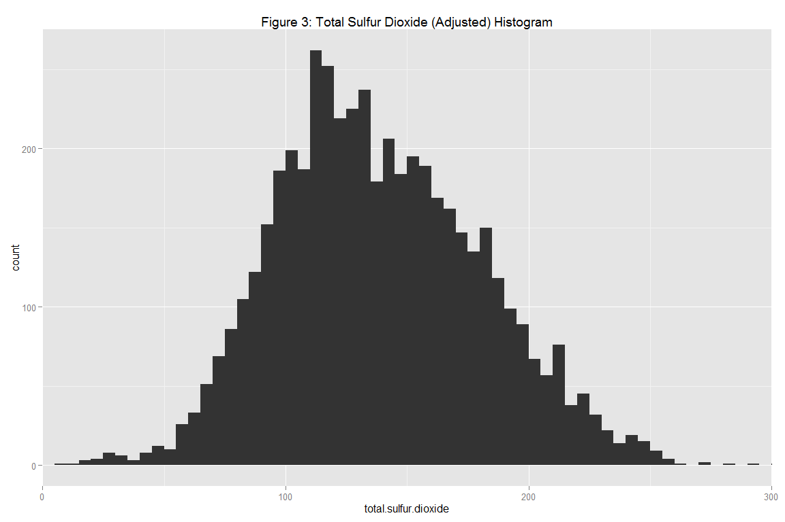
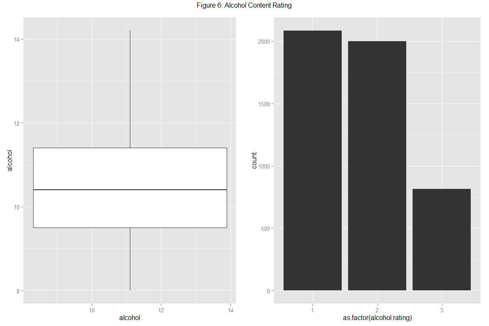
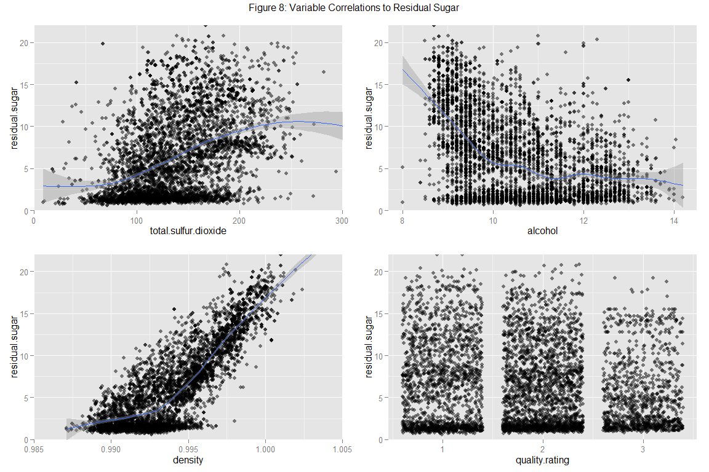

#Kaggle
###Titanic: Machine Learning from Disaster


###Introduction
This repository holds results for the Kaggle competition: Titanic: Machine Learning from Disaster.


###Data
The datasets were obtained from the Kaggle Titanic Challenge: [Kaggle page](https://www.kaggle.com/c/titanic)

* Training Dataset: [training data](https://www.kaggle.com/c/titanic-gettingStarted/download/train.csv)
* Testing Dataset: [test data](https://www.kaggle.com/c/titanic-gettingStarted/download/test.csv)


###1. Loading Packages/ Data

```r
for (package in c('knitr', 'caret', 'randomForest', 'e1071', 'gbm', 'rpart', 'rpart.plot', 'ggplot2', 'gridExtra')) {
  
  if (!require(package, character.only = TRUE, quietly = FALSE)) {
    install.packages(package)
    library(package, character.only = TRUE)
  }
  
}

val_dfname <- c("train.csv", "test.csv")
val_dfpath <- paste(getwd(), "/data", sep = "/")

val_dtrawname <- c("data_training.raw", "data_testing.raw")
val_dtname <- c("data_training", "data_testing")

val_dtclass <- c("val_trainclass", "val_testclass")

val_trainclass <- c("integer",   ## PassengerId
                    "factor",    ## Survived 
                    "factor",    ## Pclass
                    "character", ## Name
                    "factor",    ## Sex
                    "numeric",   ## Age
                    "integer",   ## SibSp
                    "integer",   ## Parch
                    "character", ## Ticket
                    "numeric",   ## Fare
                    "character", ## Cabin
                    "factor")    ## Embarked

val_testclass <- val_trainclass[-2]

for (i in 1:length(val_dtrawname)){
  
  assign(val_dtrawname[i], read.csv(paste(val_dfpath, val_dfname[i], sep = "/"), 
                                    na.strings = c("NA", ""), 
                                    colClasses = get(val_dtclass[i])))
  
  assign(val_dtname[i], get(val_dtrawname[i]))
  
}
```


###2. Pre-process the Data
Check the original data:

```r
## dim(data_training.raw)
## str(data_training.raw)
summary(data_training.raw)
```

```
##   PassengerId    Survived Pclass      Name               Sex     
##  Min.   :  1.0   0:549    1:216   Length:891         female:314  
##  1st Qu.:223.5   1:342    2:184   Class :character   male  :577  
##  Median :446.0            3:491   Mode  :character               
##  Mean   :446.0                                                   
##  3rd Qu.:668.5                                                   
##  Max.   :891.0                                                   
##                                                                  
##       Age            SibSp           Parch           Ticket         
##  Min.   : 0.42   Min.   :0.000   Min.   :0.0000   Length:891        
##  1st Qu.:20.12   1st Qu.:0.000   1st Qu.:0.0000   Class :character  
##  Median :28.00   Median :0.000   Median :0.0000   Mode  :character  
##  Mean   :29.70   Mean   :0.523   Mean   :0.3816                     
##  3rd Qu.:38.00   3rd Qu.:1.000   3rd Qu.:0.0000                     
##  Max.   :80.00   Max.   :8.000   Max.   :6.0000                     
##  NA's   :177                                                        
##       Fare           Cabin           Embarked  
##  Min.   :  0.00   Length:891         C   :168  
##  1st Qu.:  7.91   Class :character   Q   : 77  
##  Median : 14.45   Mode  :character   S   :644  
##  Mean   : 32.20                      NA's:  2  
##  3rd Qu.: 31.00                                
##  Max.   :512.33                                
## 
```

Categorize passengers by 'Title', and create new 'FamilySize' Variable:

```r
for (i in 1:length(val_dtname)){
  
  temp_data <- get(val_dtname[i])
  temp_data["Title"] <- NA
  temp_data["FamilySize"] <- NA
  
  for (j in 1:nrow(temp_data)){
    
    temp_data[j, "Title"] <- strsplit(temp_data[j, "Name"], split='[,.]')[[1]][2]
    temp_data[j, "FamilySize"] <- temp_data[j, "SibSp"] + temp_data[j, "Parch"] + 1
    
  }
  
  temp_data[temp_data == ""] <- NA
  
  temp_data$Title = as.character(temp_data$Title)
  temp_data$FamilySize = as.integer(temp_data$FamilySize)
  ## print(sum(is.na(temp_data$Title)))
  ## print(sum(is.na(temp_data$FamilySize)))
  assign(val_dtname[i], temp_data)
  
}

rm(temp_data)
```

Replace NA values within numeric class columns with mean and NA values within other class columns with most common occurrence:

```r
for (i in 1:length(val_dtname)){
  
  temp_data <- get(val_dtname[i])
  
  for (j in 1:ncol(temp_data)) {
    
    if (class(temp_data[, j]) == "numeric") {
      
      temp_colmean <- mean(temp_data[, j], na.rm = TRUE)
      temp_data[, j][which(is.na(temp_data[, j]))] <- temp_colmean
      
    } else {
      
      temp_colmode <- tail(names(sort(table(temp_data[, j]))), 1)
      temp_data[, j][which(is.na(temp_data[, j]))] <- temp_colmode

    }
    
  }
   
  assign(val_dtname[i], temp_data)

}
  
rm(temp_data, temp_colmean, temp_colmode)
```

Check the processed data:

```r
## dim(data_training)
## str(data_training)
summary(data_training)
```

```
##  PassengerId        Survived Pclass      Name               Sex     
##  Length:891         0:549    1:216   Length:891         female:314  
##  Class :character   1:342    2:184   Class :character   male  :577  
##  Mode  :character            3:491   Mode  :character               
##                                                                     
##                                                                     
##                                                                     
##       Age           SibSp              Parch              Ticket         
##  Min.   : 0.42   Length:891         Length:891         Length:891        
##  1st Qu.:22.00   Class :character   Class :character   Class :character  
##  Median :29.70   Mode  :character   Mode  :character   Mode  :character  
##  Mean   :29.70                                                           
##  3rd Qu.:35.00                                                           
##  Max.   :80.00                                                           
##       Fare           Cabin           Embarked    Title          
##  Min.   :  0.00   Length:891         C:168    Length:891        
##  1st Qu.:  7.91   Class :character   Q: 77    Class :character  
##  Median : 14.45   Mode  :character   S:646    Mode  :character  
##  Mean   : 32.20                                                 
##  3rd Qu.: 31.00                                                 
##  Max.   :512.33                                                 
##   FamilySize       
##  Length:891        
##  Class :character  
##  Mode  :character  
##                    
##                    
## 
```

Check the processed data:

```r
tblsumfunc <- function(x){

  temp_data <- data.frame(Survived = data_training$Survived, Title = data_training[[x]], stringsAsFactors = FALSE)
  temp_obscount <- sort(table(temp_data[, 2]), decreasing = FALSE)
  
  if (nrow(temp_obscount) > 10) {
    
    if (class(temp_data[, 2]) == "numeric") {
      
      temp_data[, 2] <- 10 * ceiling(temp_data[, 2] / 10)
      ## table(temp_data)
      
    } else {
    
      temp_lfobsnm <- names(temp_obscount[1:(dim(temp_obscount) - 10)])
      temp_data[, 2][which(is.element(temp_data[, 2], temp_lfobsnm))] <- "Other"
      ## table(temp_data)
      
    }
    
  }
  
  temp_table <- table(temp_data)
  temp_sumtable <- addmargins(temp_table, FUN = list(Total = sum), quiet = TRUE)
  temp_proptable <- prop.table(temp_sumtable[c(1, 2),], 2)
  temp_mergedtable <- rbind(temp_sumtable[1, ], 
                            temp_proptable[1, ], 
                            temp_sumtable[2, ], 
                            temp_proptable[2, ], 
                            temp_sumtable[3, ])
  rownames(temp_mergedtable) <- c("Didn't Survive", "%", "Survived", "%", "Total")
  
  print(x)
  temp_kabletable <- kable(temp_mergedtable, digits = 2, caption = "test", output = FALSE)
  cat(temp_kabletable, sep="\n")
  cat(sep="\n\n")
  
  rm(temp_data, temp_table, temp_sumtable, temp_proptable, temp_mergedtable)
  
}
  
val_sumcolname <- list("Pclass", "Title", "Sex", "Age", "FamilySize")

for(colname in val_sumcolname) { tblsumfunc(colname) }
```

```
## [1] "Pclass"
## Table: test
## 
##                        1        2        3    Total
## ---------------  -------  -------  -------  -------
## Didn't Survive     80.00    97.00   372.00   549.00
## %                   0.37     0.53     0.76     0.62
## Survived          136.00    87.00   119.00   342.00
## %                   0.63     0.47     0.24     0.38
## Total             216.00   184.00   491.00   891.00
## 
## [1] "Title"
## Table: test
## 
##                    Col     Dr    Major    Master    Miss    Mlle       Mr      Mrs    Rev    the Countess   Other    Total
## ---------------  -----  -----  -------  --------  ------  ------  -------  -------  -----  --------------  ------  -------
## Didn't Survive     1.0   4.00      1.0     17.00    55.0       0   436.00    26.00      6               0    3.00   549.00
## %                  0.5   0.57      0.5      0.42     0.3       0     0.84     0.21      1               0    0.43     0.62
## Survived           1.0   3.00      1.0     23.00   127.0       2    81.00    99.00      0               1    4.00   342.00
## %                  0.5   0.43      0.5      0.57     0.7       1     0.16     0.79      0               1    0.57     0.38
## Total              2.0   7.00      2.0     40.00   182.0       2   517.00   125.00      6               1    7.00   891.00
## 
## [1] "Sex"
## Table: test
## 
##                   female     male    Total
## ---------------  -------  -------  -------
## Didn't Survive     81.00   468.00   549.00
## %                   0.26     0.81     0.62
## Survived          233.00   109.00   342.00
## %                   0.74     0.19     0.38
## Total             314.00   577.00   891.00
## 
## [1] "Age"
## Table: test
## 
##                      10       20       30       40      50     60      70    80    Total
## ---------------  ------  -------  -------  -------  ------  -----  ------  ----  -------
## Didn't Survive    26.00    71.00   271.00    86.00   53.00   25.0   13.00   4.0   549.00
## %                  0.41     0.62     0.67     0.55    0.62    0.6    0.76   0.8     0.62
## Survived          38.00    44.00   136.00    69.00   33.00   17.0    4.00   1.0   342.00
## %                  0.59     0.38     0.33     0.45    0.38    0.4    0.24   0.2     0.38
## Total             64.00   115.00   407.00   155.00   86.00   42.0   17.00   5.0   891.00
## 
## [1] "FamilySize"
## Table: test
## 
##                       1   11        2        3       4      5       6       7    8    Total
## ---------------  ------  ---  -------  -------  ------  -----  ------  ------  ---  -------
## Didn't Survive    374.0    7    72.00    43.00    8.00   12.0   19.00    8.00    6   549.00
## %                   0.7    1     0.45     0.42    0.28    0.8    0.86    0.67    1     0.62
## Survived          163.0    0    89.00    59.00   21.00    3.0    3.00    4.00    0   342.00
## %                   0.3    0     0.55     0.58    0.72    0.2    0.14    0.33    0     0.38
## Total             537.0    7   161.00   102.00   29.00   15.0   22.00   12.00    6   891.00
```
At a high level, the data suggests that passengers within the following groups had an improved survival rate:
* Were Class 1 passengers
* Had a title of 'Master' / aged 0-10
* Were female
* Boarded with a family of size 2-4

Chart the processed data:

```r
val_agehist <- ggplot(data_training, aes(x = Age, fill = Survived)) +
                      geom_histogram() +
                      ggtitle("Age vs Survival") +
                      theme(legend.position = "bottom") +
                      scale_fill_discrete(labels = c("No", "Yes"))

val_sexhist <- ggplot(data_training, aes(x = Sex, fill = Survived)) +
                      geom_histogram() +
                      ggtitle("Age vs Survival") +
                      theme(legend.position = "bottom") +
                      scale_fill_discrete(labels = c("No", "Yes"))

grid.arrange(val_agehist, val_sexhist, ncol = 2)
```

 

```r
val_pclasshist <- ggplot(data_training, aes(x = Pclass, fill = Survived)) +
                        geom_histogram() +
                        ggtitle("Passenger Class vs Survival") +
                        theme(legend.position = "right") +
                        scale_fill_discrete(labels = c("No", "Yes"))

val_titlehist <- ggplot(data_training, aes(x = Title, fill = Survived)) +
                        geom_histogram() +
                        ggtitle("Title vs Survival") +
                        theme(legend.position = "right") +
                        scale_fill_discrete(labels = c("No", "Yes"))

val_familyhist <- ggplot(data_training, aes(x = FamilySize, fill = Survived)) +
                        geom_histogram() +
                        ggtitle("Family Size vs Survival") +
                        theme(legend.position = "right") +
                        scale_fill_discrete(labels = c("No", "Yes"))

grid.arrange(val_pclasshist, val_titlehist, val_familyhist, nrow = 3)
```

 


###3. Prediction Modelling

Split the training data:

```r
set.seed(12345)
data_training.rows <- createDataPartition(data_training$Survived, p = 0.7, list = FALSE)

data_training.train <- data_training[data_training.rows, ]
data_training.test <- data_training[-data_training.rows, ]
```

Check the split data:

```r
## dim(data_training.train)
str(data_training.train)
```

```
## 'data.frame':	625 obs. of  14 variables:
##  $ PassengerId: chr  "1" "3" "4" "6" ...
##  $ Survived   : Factor w/ 2 levels "0","1": 1 2 2 1 1 1 2 2 2 1 ...
##  $ Pclass     : Factor w/ 3 levels "1","2","3": 3 3 1 3 1 3 3 2 1 3 ...
##  $ Name       : chr  "Braund, Mr. Owen Harris" "Heikkinen, Miss. Laina" "Futrelle, Mrs. Jacques Heath (Lily May Peel)" "Moran, Mr. James" ...
##  $ Sex        : Factor w/ 2 levels "female","male": 2 1 1 2 2 2 1 1 1 2 ...
##  $ Age        : num  22 26 35 29.7 54 ...
##  $ SibSp      : chr  "1" "0" "1" "0" ...
##  $ Parch      : chr  "0" "0" "0" "0" ...
##  $ Ticket     : chr  "A/5 21171" "STON/O2. 3101282" "113803" "330877" ...
##  $ Fare       : num  7.25 7.92 53.1 8.46 51.86 ...
##  $ Cabin      : chr  "G6" "G6" "C123" "G6" ...
##  $ Embarked   : Factor w/ 3 levels "C","Q","S": 3 3 3 2 3 3 3 1 3 3 ...
##  $ Title      : chr  " Mr" " Miss" " Mrs" " Mr" ...
##  $ FamilySize : chr  "2" "1" "2" "1" ...
```

```r
## summary(data_training.train)

## dim(data_training.test)
str(data_training.test)
```

```
## 'data.frame':	266 obs. of  14 variables:
##  $ PassengerId: chr  "2" "5" "11" "16" ...
##  $ Survived   : Factor w/ 2 levels "0","1": 2 1 2 2 2 1 1 2 1 2 ...
##  $ Pclass     : Factor w/ 3 levels "1","2","3": 1 3 3 2 3 2 3 3 2 3 ...
##  $ Name       : chr  "Cumings, Mrs. John Bradley (Florence Briggs Thayer)" "Allen, Mr. William Henry" "Sandstrom, Miss. Marguerite Rut" "Hewlett, Mrs. (Mary D Kingcome) " ...
##  $ Sex        : Factor w/ 2 levels "female","male": 1 2 1 1 1 2 1 1 2 2 ...
##  $ Age        : num  38 35 4 55 29.7 ...
##  $ SibSp      : chr  "1" "0" "1" "0" ...
##  $ Parch      : chr  "0" "0" "1" "0" ...
##  $ Ticket     : chr  "PC 17599" "373450" "PP 9549" "248706" ...
##  $ Fare       : num  71.28 8.05 16.7 16 7.22 ...
##  $ Cabin      : chr  "C85" "G6" "G6" "G6" ...
##  $ Embarked   : Factor w/ 3 levels "C","Q","S": 1 3 3 3 1 3 3 3 3 1 ...
##  $ Title      : chr  " Mrs" " Mr" " Miss" " Mrs" ...
##  $ FamilySize : chr  "2" "1" "3" "1" ...
```

```r
## summary(data_training.test)
```

####Decision tree prediction

```r
set.seed(12345)
val_dtmodel <- rpart(Survived ~ Pclass + Sex + Age + Fare + Embarked + FamilySize, data = data_training.train, method = "class")
val_dtmodel.predict <- predict(val_dtmodel, data_training.test, type = "class")
val_dtcm <- confusionMatrix(val_dtmodel.predict, data_training.test$Survived)
val_dtcm
```

```
## Confusion Matrix and Statistics
## 
##           Reference
## Prediction   0   1
##          0 145  38
##          1  19  64
##                                           
##                Accuracy : 0.7857          
##                  95% CI : (0.7315, 0.8335)
##     No Information Rate : 0.6165          
##     P-Value [Acc > NIR] : 2.603e-09       
##                                           
##                   Kappa : 0.5303          
##  Mcnemar's Test P-Value : 0.01712         
##                                           
##             Sensitivity : 0.8841          
##             Specificity : 0.6275          
##          Pos Pred Value : 0.7923          
##          Neg Pred Value : 0.7711          
##              Prevalence : 0.6165          
##          Detection Rate : 0.5451          
##    Detection Prevalence : 0.6880          
##       Balanced Accuracy : 0.7558          
##                                           
##        'Positive' Class : 0               
## 
```

Decision tree prediction has a reported accuracy against the training dataset:

```r
round(val_dtcm$overall['Accuracy'], 4)
```

```
## Accuracy 
##   0.7857
```


```r
plot(val_dtcm$table, 
    col = val_dtcm$byClass, 
    main = paste("Decision Tree Confusion Matrix: Accuracy =", 
    round(val_dtcm$overall['Accuracy'], 4)))
```

 

#### Random forest prediction

```r
set.seed(12345)
val_rfmodel <- randomForest(Survived ~ Pclass + Sex + Age + Fare + Embarked + FamilySize, data = data_training.train)
val_rfmodel.predict <- predict(val_rfmodel, data_training.test, type = "class")
val_rfcm <- confusionMatrix(val_rfmodel.predict, data_training.test$Survived)
val_rfcm
```

```
## Confusion Matrix and Statistics
## 
##           Reference
## Prediction   0   1
##          0 149  33
##          1  15  69
##                                          
##                Accuracy : 0.8195         
##                  95% CI : (0.768, 0.8638)
##     No Information Rate : 0.6165         
##     P-Value [Acc > NIR] : 5.675e-13      
##                                          
##                   Kappa : 0.6052         
##  Mcnemar's Test P-Value : 0.01414        
##                                          
##             Sensitivity : 0.9085         
##             Specificity : 0.6765         
##          Pos Pred Value : 0.8187         
##          Neg Pred Value : 0.8214         
##              Prevalence : 0.6165         
##          Detection Rate : 0.5602         
##    Detection Prevalence : 0.6842         
##       Balanced Accuracy : 0.7925         
##                                          
##        'Positive' Class : 0              
## 
```

Random forest prediction has a reported accuracy against the training dataset:

```r
round(val_rfcm$overall['Accuracy'], 4)
```

```
## Accuracy 
##   0.8195
```


```r
plot(val_rfcm$table, 
    col = val_rfcm$byClass, 
    main = paste("Random Forest Confusion Matrix: Accuracy =",
    round(val_rfcm$overall['Accuracy'], 4)))
```

 

#### Generalized boosted regression prediction

```r
set.seed(12345)
val_fitControl <- trainControl(method = "repeatedcv", number = 5, repeats = 1)
val_gbmmodel <- train(Survived ~ Pclass + Sex + Age + Fare + Embarked + FamilySize, data = data_training.train, method = "gbm", trControl = val_fitControl, verbose = FALSE)
val_gbmmodel.predict <- predict(val_gbmmodel, newdata = data_training.test)
val_gbmcm <- confusionMatrix(val_gbmmodel.predict, data_training.test$Survived)
val_gbmcm
```

```
## Confusion Matrix and Statistics
## 
##           Reference
## Prediction   0   1
##          0 148  39
##          1  16  63
##                                           
##                Accuracy : 0.7932          
##                  95% CI : (0.7395, 0.8403)
##     No Information Rate : 0.6165          
##     P-Value [Acc > NIR] : 4.694e-10       
##                                           
##                   Kappa : 0.5432          
##  Mcnemar's Test P-Value : 0.003012        
##                                           
##             Sensitivity : 0.9024          
##             Specificity : 0.6176          
##          Pos Pred Value : 0.7914          
##          Neg Pred Value : 0.7975          
##              Prevalence : 0.6165          
##          Detection Rate : 0.5564          
##    Detection Prevalence : 0.7030          
##       Balanced Accuracy : 0.7600          
##                                           
##        'Positive' Class : 0               
## 
```

Generalized boosted regression prediction has a reported accuracy against the training dataset:

```r
round(val_gbmcm$overall['Accuracy'], 4)
```

```
## Accuracy 
##   0.7932
```


```r
plot(val_gbmcm$table, 
     col = val_gbmcm$byClass,
     main = paste("Generalized Boosted Regression Confusion Matrix: Accuracy =",
     round(val_gbmcm$overall['Accuracy'], 4)))
```

 


###4. Model Selection
The expected out-of-sample error is calculated as 1 - accuracy for predictions made against the cross-validation set:

```r
val_ooserror <- 1 - round(val_rfcm$overall['Accuracy'], 4)
## val_ooserror <- 1 - round(val_gbmcm$overall['Accuracy'], 4)
val_ooserror
```

```
## Accuracy 
##   0.1805
```


```r
val_selmodel.final <- predict(val_rfmodel, data_testing)
## val_selmodel.final <- predict(val_gbmmodel, data_testing)
```


###5. Kaggle Submission

```r
data_prediction <- data.frame(PassengerId = data_testing$PassengerId, Survived = val_selmodel.final)
write.table(data_prediction,"data/prediction.csv", row.names = FALSE, sep=",", col.names = TRUE)
```
