#Explore and Summarize Data
###Project: ND_Project4


###Introduction
This repository holds results for the Udacity Nanodegree Project: Explore and Summarize Data. For this project, I selected the 'White Wine Quality' dataset and exercised Exploratory Data Analysis techniques in order to investigate property relationships.


###Data
The original datafile: 'WineQualityWhites.csv' contains information on 11 chemical and physical properties for 4,898 white wines. Also included is a quality ranking and an explicit ID.

The datafile was obtained from: [Dataset link](https://s3.amazonaws.com/udacity-hosted-downloads/ud651/wineQualityWhites.csv)

Chemical Properties:

* fixed acidity: most acids involved with wine are fixed or nonvolatile (do not evaporate readily) (tartaric acid - g / dm^3)
* volatile acidity: the amount of acetic acid in wine, which at too high of levels can lead to an unpleasant, vinegar taste (acetic acid - g / dm^3)
* citric acid: found in small quantities, citric acid can add 'freshness' and flavor to wines (g / dm^3)
* residual sugar: the amount of sugar remaining after fermentation stops (g / dm^3)
* chlorides: the amount of salt in the wine (sodium chloride - g / dm^3
* free sulfur dioxide: free form of SO2 exists in equilibrium between molecular SO2 (as a dissolved gas) and bisulfite ion (mg / dm^3)
* total sulfur dioxide: amount of free and bound forms of S02 (mg / dm^3)
* density: the density of wine is close to that of water depending on the percent alcohol and sugar content (g / cm^3)
* pH: describes how acidic or basic a wine is on a scale from 0 (very acidic) to 14 (very basic)
* sulphates: a wine additive which can contribute to sulfur dioxide gas (S02) levels (potassium sulphate - g / dm3)
* alcohol: the percent alcohol content of the wine (% by volume)

Output variable (based on sensory data):

* Quality (score of wine between 0 and 10)


###1. Loading Packages/ Data
The following packages are loaded for this exercise:

* ggplot2: An implementation of the grammar of graphics in R. It combines the advantages of both base and lattice graphics: conditioning and shared axes are handled automatically, and you can still build up a plot step by step from multiple data sources. It also implements a sophisticated multidimensional conditioning system and a consistent interface to map data to aesthetic attributes.
* GGally: GGally is designed to be a helper to ggplot2. It contains templates for different plots to be combined into a plot matrix, a parallel coordinate plot function, as well as a function for making a network plot.
* gridExtra: Provides a number of user-level functions to work with "grid" graphics, notably to arrange multiple grid-based plots on a page, and draw tables.
* data.table: Fast aggregation of large data (e.g. 100GB in RAM), fast ordered joins, fast add/modify/delete of columns by group using no copies at all, list columns and a fast file reader (fread). Offers a natural and flexible syntax, for faster development.


The original datafile: WineQualityWhites.csv is loaded into a dataframe with any possible "NA" or blank entries tagged as na.strings.


The below provides a summary of the raw dataframe structure.

```r
##dim(data_wine.raw)
str(data_wine.raw)
```

```
## 'data.frame':	4898 obs. of  13 variables:
##  $ X                   : int  1 2 3 4 5 6 7 8 9 10 ...
##  $ fixed.acidity       : num  7 6.3 8.1 7.2 7.2 8.1 6.2 7 6.3 8.1 ...
##  $ volatile.acidity    : num  0.27 0.3 0.28 0.23 0.23 0.28 0.32 0.27 0.3 0.22 ...
##  $ citric.acid         : num  0.36 0.34 0.4 0.32 0.32 0.4 0.16 0.36 0.34 0.43 ...
##  $ residual.sugar      : num  20.7 1.6 6.9 8.5 8.5 6.9 7 20.7 1.6 1.5 ...
##  $ chlorides           : num  0.045 0.049 0.05 0.058 0.058 0.05 0.045 0.045 0.049 0.044 ...
##  $ free.sulfur.dioxide : num  45 14 30 47 47 30 30 45 14 28 ...
##  $ total.sulfur.dioxide: num  170 132 97 186 186 97 136 170 132 129 ...
##  $ density             : num  1.001 0.994 0.995 0.996 0.996 ...
##  $ pH                  : num  3 3.3 3.26 3.19 3.19 3.26 3.18 3 3.3 3.22 ...
##  $ sulphates           : num  0.45 0.49 0.44 0.4 0.4 0.44 0.47 0.45 0.49 0.45 ...
##  $ alcohol             : num  8.8 9.5 10.1 9.9 9.9 10.1 9.6 8.8 9.5 11 ...
##  $ quality             : int  6 6 6 6 6 6 6 6 6 6 ...
```

```r
##summary(data_wine.raw)
```

###2. Pre-process the Data
As part of the pre-processing routine, an effort was made to identify any potential new series which could be created from mathematical operations or categorization of the existing variables.

A new series of the ratio between free sulfur dioxide and total sulfur dioxide was created named 'sulf.ratio'.


The below shows a summary of the generated sulf.ratio variable.

```r
summary(data_wine$sulf.ratio)
```

```
##    Min. 1st Qu.  Median    Mean 3rd Qu.    Max. 
## 0.02362 0.19090 0.25370 0.25560 0.31580 0.71050
```

Additionally, two new category series were created:

* 'quality.rating': Categorizes wine quality score into three new categories: 1:Poor (5 score or less), 2:Good (6 score), 3:Great (7 score or greater).
* 'alcohol.rating': Categorizes wine alcohol content into three new categories: 1:Light (9% or less), 2:Mild (between 10% and 12%), 3:Strong (12% or greater).


The below shows a summary of the created quality.rating variable:

```r
summary(data_wine$quality.rating)
```

```
##    Min. 1st Qu.  Median    Mean 3rd Qu.    Max. 
##   1.000   1.000   2.000   1.882   2.000   3.000
```

The below shows a summary of the created alcohol.rating variable:

```r
summary(data_wine$alcohol.rating)
```

```
##    Min. 1st Qu.  Median    Mean 3rd Qu.    Max. 
##    1.00    1.00    2.00    1.74    2.00    3.00
```

A summary of the updated dataframe structure is shown, capturing the added variables.

```
## 'data.frame':	4898 obs. of  16 variables:
##  $ X                   : int  1 2 3 4 5 6 7 8 9 10 ...
##  $ fixed.acidity       : num  7 6.3 8.1 7.2 7.2 8.1 6.2 7 6.3 8.1 ...
##  $ volatile.acidity    : num  0.27 0.3 0.28 0.23 0.23 0.28 0.32 0.27 0.3 0.22 ...
##  $ citric.acid         : num  0.36 0.34 0.4 0.32 0.32 0.4 0.16 0.36 0.34 0.43 ...
##  $ residual.sugar      : num  20.7 1.6 6.9 8.5 8.5 6.9 7 20.7 1.6 1.5 ...
##  $ chlorides           : num  0.045 0.049 0.05 0.058 0.058 0.05 0.045 0.045 0.049 0.044 ...
##  $ free.sulfur.dioxide : num  45 14 30 47 47 30 30 45 14 28 ...
##  $ total.sulfur.dioxide: num  170 132 97 186 186 97 136 170 132 129 ...
##  $ density             : num  1.001 0.994 0.995 0.996 0.996 ...
##  $ pH                  : num  3 3.3 3.26 3.19 3.19 3.26 3.18 3 3.3 3.22 ...
##  $ sulphates           : num  0.45 0.49 0.44 0.4 0.4 0.44 0.47 0.45 0.49 0.45 ...
##  $ alcohol             : num  8.8 9.5 10.1 9.9 9.9 10.1 9.6 8.8 9.5 11 ...
##  $ quality             : int  6 6 6 6 6 6 6 6 6 6 ...
##  $ sulf.ratio          : num  0.265 0.106 0.309 0.253 0.253 ...
##  $ quality.rating      : num  2 2 2 2 2 2 2 2 2 2 ...
##  $ alcohol.rating      : num  1 1 2 1 1 2 1 1 1 2 ...
```


###3. Univariate Analysis
Univariate analysis is intended to provide insights of absolute levels of individual series within the dataset.

As a first pass of univariate analysis, histograms were generated for each of the original dataset variables. This was done by looping the ggplot function for each variable and using grid.arrange to present all plots within the same plot space.
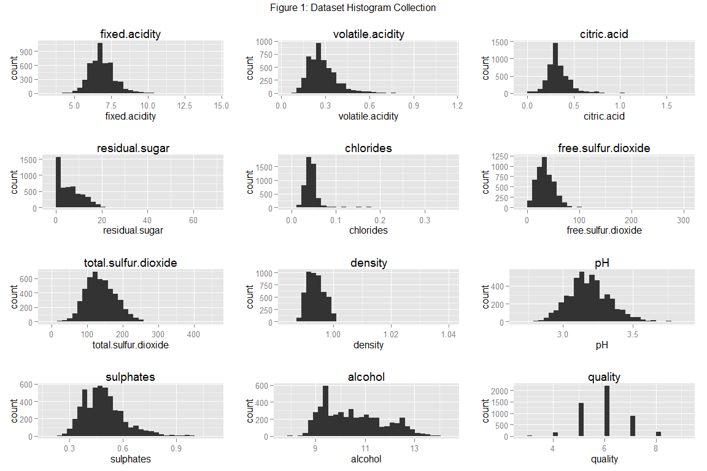 
The majority of variables are approximately normally distributed and many have a positive skew. Judging by the automatically adjusted scale on each distribution, it seems there are also a small number of outliers within some variables.

The below shows a histogram and summary metrics for total sulfur dioxide.
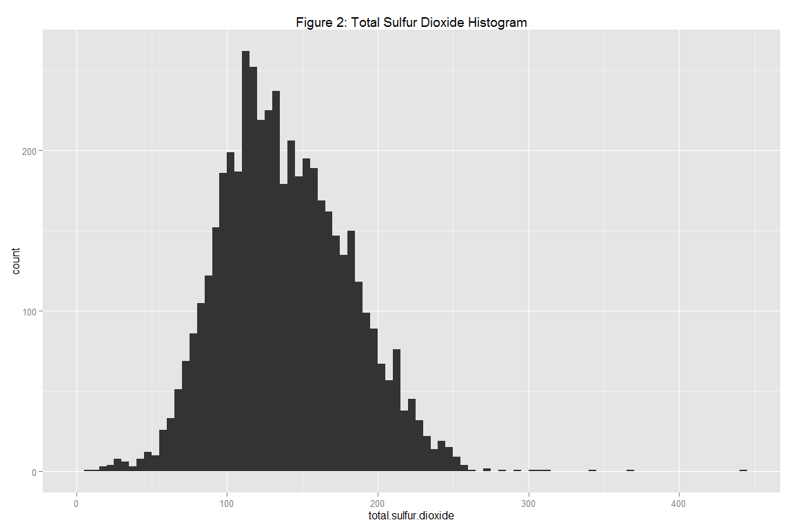 

```
##    Min. 1st Qu.  Median    Mean 3rd Qu.    Max. 
##     9.0   108.0   134.0   138.4   167.0   440.0
```
The min free sulfur dioxide value is 9.0 mg/dm^3, the max is 440.0 mg/dm^3. As per the comment made above, it seems the 440 mg/dm^3 is an outlier.

The below shows a histogram and summary metrics excluding observations where free sulfur dioxide is greater than 300 mg/dm^3.
 

```
##    Min. 1st Qu.  Median    Mean 3rd Qu.    Max. 
##     9.0   108.0   134.0   138.1   167.0   294.0
```

Each wine has both a free sulfur dioxide count and total sulfur dioxide count. The below shows a histogram and summary metrics for the ratio of the two.
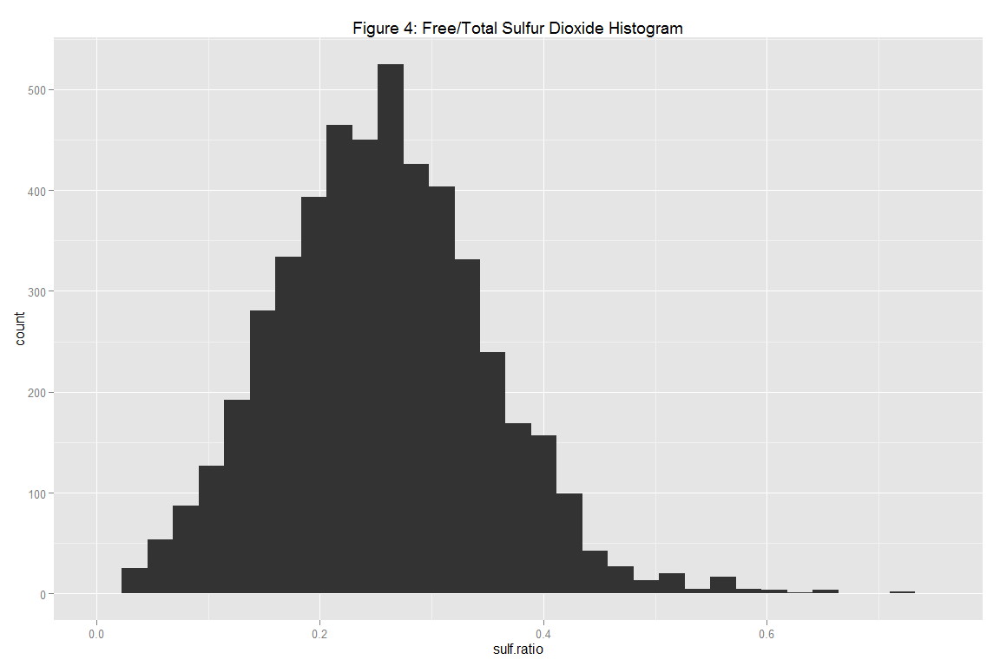 

```
##    Min. 1st Qu.  Median    Mean 3rd Qu.    Max. 
## 0.02362 0.19090 0.25370 0.25560 0.31580 0.71050
```
Note that using a summary metric such as the one above provides another method of accounting for the extreme free/total sulfur dioxide outliers.

The below shows a histogram and summary metrics for wine pH.
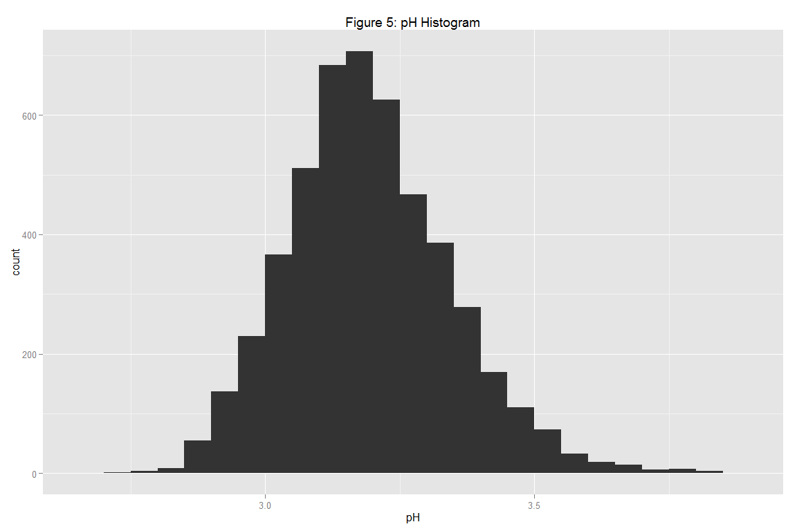 

```
##    Min. 1st Qu.  Median    Mean 3rd Qu.    Max. 
##   2.720   3.090   3.180   3.188   3.280   3.820
```
Based on recorded pH levels, it seems the tested wines are acidic (pH < 7) falling within the range of 2.7 pH to 3.8 pH.

The below shows a histogram and summary metrics for wine alcohol content.
 

```
##    Min. 1st Qu.  Median    Mean 3rd Qu.    Max. 
##    8.00    9.50   10.40   10.51   11.40   14.20
```
It seems higher alcohol content wines (> 12%) are less common than lower alcohol content wines.

The below shows a histogram and summary metrics for the wine quality ratings.
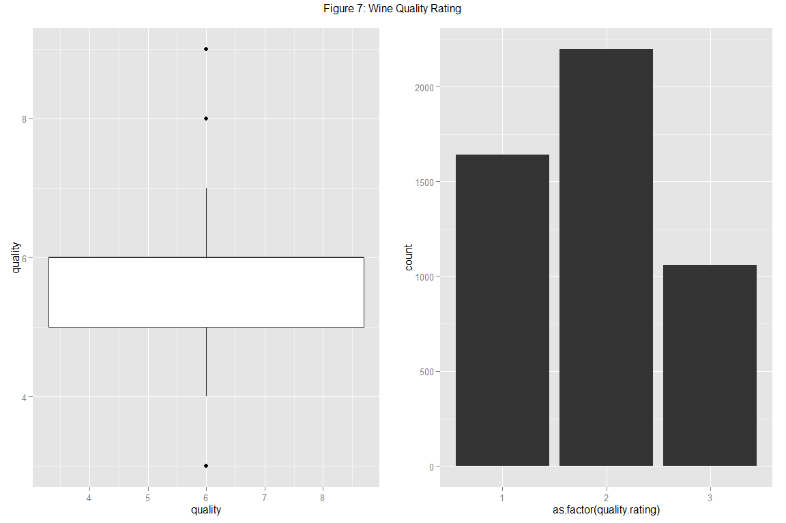 

```
##    Min. 1st Qu.  Median    Mean 3rd Qu.    Max. 
##   3.000   5.000   6.000   5.878   6.000   9.000
```
For most wines, the quality score falls between 5 and 6. There are a few exceptions of wines with scores of 8 or above, and of 4 or below.

Q: What is the structure of your dataset?
The raw dataset has 12 columns representing various wine properties and 4,898 rows each representing recorded observations. The majority of variables are quantitative measurements of a chemical or physical property. One variable is a subjective labeling of the quality of wine taste.

Q: What is/are the main feature(s) of interest in your dataset?
As a first pass, the main feature of interest seems to be the wine quality, and whether the data supports a relationship between perceived quality and any/all of the recorded chemical properties.

Q: What other features in the dataset do you think will help support your investigation into your feature(s) of interest?
At this stage, it is difficult to rule out any relationships butI suspect sulphur content, acidity, pH and alcohol content will have a relationship with perceived quality.

Q: Did you create any new variables from existing variables in the dataset?
Yes, a variable which shows the ratio of free sulfur dioxide to total sulfur dioxide and two variables which re-categorize wine quality ratings/alcohol content.

Q: Of the features you investigated, were there any unusual distributions? Did you perform any operations on the data to tidy, adjust, or change the form of the data? If so, why did you do this?
The majority of variables are approximately normally distributed, however many have a positive skew. There also seems to be a number of outliers within each of the dataset variables. No data transformations have been performed as the intention at this stage is to limit axis ranges for plots in order to account for outliers within each visual representation.


###4. Bivariate Analysis
Bivariate analysis is intended to provide insights of the relationship between any pair of variables within the dataset.

As a first pass of bivariate analysis, a correlation matrix was generated for each of the original dataset variables. The 'cor' function was used to generate the matrix while an alphabetical reference list was made for each variable.

```
##       A     B     C     D     E     F     G     H     I     J     K     L
## A  1.00 -0.26  0.00 -0.15  0.01 -0.05 -0.01 -0.16 -0.19 -0.12  0.01  0.21
## B -0.26  1.00 -0.02  0.29  0.09  0.02 -0.05  0.09  0.27 -0.43 -0.02 -0.12
## C  0.00 -0.02  1.00 -0.15  0.06  0.07 -0.10  0.09  0.03 -0.03 -0.04  0.07
## D -0.15  0.29 -0.15  1.00  0.09  0.11  0.09  0.12  0.15 -0.16  0.06 -0.08
## E  0.01  0.09  0.06  0.09  1.00  0.09  0.30  0.40  0.84 -0.19 -0.03 -0.45
## F -0.05  0.02  0.07  0.11  0.09  1.00  0.10  0.20  0.26 -0.09  0.02 -0.36
## G -0.01 -0.05 -0.10  0.09  0.30  0.10  1.00  0.62  0.29  0.00  0.06 -0.25
## H -0.16  0.09  0.09  0.12  0.40  0.20  0.62  1.00  0.53  0.00  0.13 -0.45
## I -0.19  0.27  0.03  0.15  0.84  0.26  0.29  0.53  1.00 -0.09  0.07 -0.78
## J -0.12 -0.43 -0.03 -0.16 -0.19 -0.09  0.00  0.00 -0.09  1.00  0.16  0.12
## K  0.01 -0.02 -0.04  0.06 -0.03  0.02  0.06  0.13  0.07  0.16  1.00 -0.02
## L  0.21 -0.12  0.07 -0.08 -0.45 -0.36 -0.25 -0.45 -0.78  0.12 -0.02  1.00
## M  0.04 -0.11 -0.19 -0.01 -0.10 -0.21  0.01 -0.17 -0.31  0.10  0.05  0.44
##       M
## A  0.04
## B -0.11
## C -0.19
## D -0.01
## E -0.10
## F -0.21
## G  0.01
## H -0.17
## I -0.31
## J  0.10
## K  0.05
## L  0.44
## M  1.00
```

```
##       [,1]                   [,2]
##  [1,] "X"                    "A" 
##  [2,] "fixed.acidity"        "B" 
##  [3,] "volatile.acidity"     "C" 
##  [4,] "citric.acid"          "D" 
##  [5,] "residual.sugar"       "E" 
##  [6,] "chlorides"            "F" 
##  [7,] "free.sulfur.dioxide"  "G" 
##  [8,] "total.sulfur.dioxide" "H" 
##  [9,] "density"              "I" 
## [10,] "pH"                   "J" 
## [11,] "sulphates"            "K" 
## [12,] "alcohol"              "L" 
## [13,] "quality"              "M"
```

The strongest correlations between the dataset variables are between:

* Correl1: I:density and E:residual sugar (0.84)
* Correl2: I:density and H:total sulfur dioxide (0.53)
* Correl3: I:density and L:alcohol (-0.78)
* Correl4: H:total sulfur dioxide and G:free sulfur dioxide (0.62)

Correlation 4 is intuitive as these dataset variables are derivations of the other. Correlations 1, 2 and 3 are of interest however, and warrant further investigation. The following plots focus on the relationship between residual sugar, total sulfur dioxide, alcohol, density and wine quality rating.

Scatterplots of correlations between the variables of interest and residual sugar are shown below.
 
There is a positive relationship between residual sugar and total sulfur dioxide/density and a negative relationship between residual sugar and alcohol. It seems that the negative relationship between residual sugar and alcohol is strongest in wines with a low alcohol content (< ~10%). While the strong positive relationship between residual sugar and density is less strong for low residual sugar levels (< ~5 g/dm^3).

Scatterplots of correlations between the variables of interest and total sulfur dioxide are shown below.
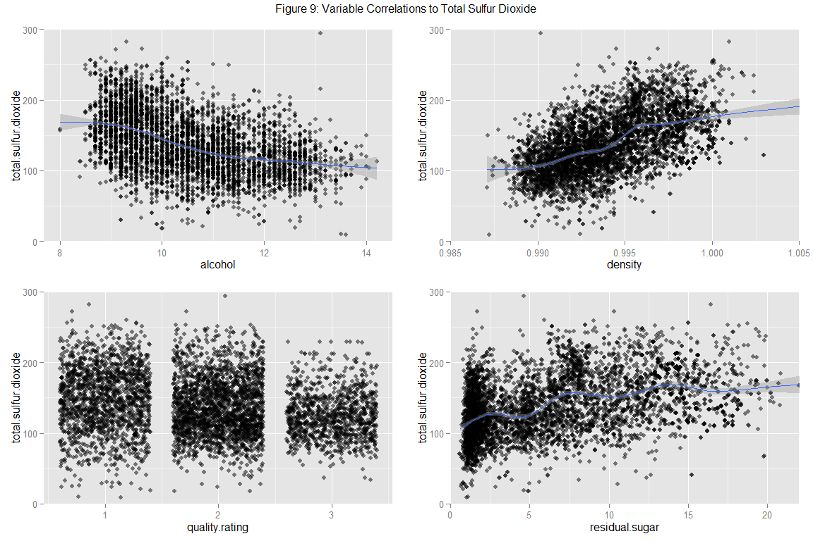 
Both the negative correlation between total sulfur dioxide and alcohol (-0.45) as well as the positive correlation between total sulfur dioxide and density (0.53) are confirmed in the scatterplots above. Interestingly the linear relationship between total sulfur dioxide and density seems to have a 'step' at a density level (~0.9995 g/cm^3).

Scatterplots of correlations between the variables of interest and alcohol are shown below.
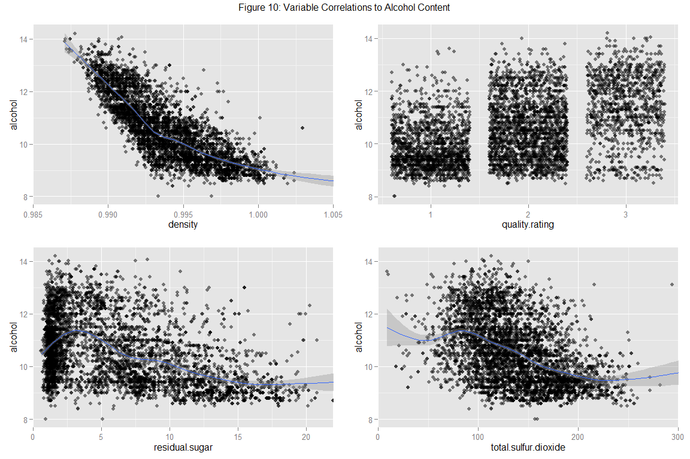 
Again, the strong negative correlation between alcohol and density (-0.78) is immediately obvious. Interestingly, there also seems to be a relationship between alcohol and perceived wine quality, which the correlation matrix above confirms (0.44). This is investigated further below.

Histograms of wine quality ratings by alcohol content are shown below.
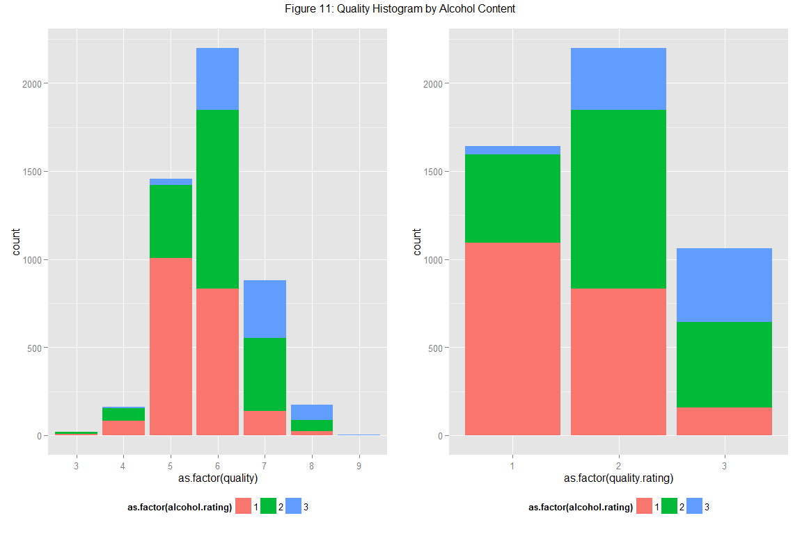 
Higher alcohol content wines: 2:Mild (between 10% and 12%) and, 3:Strong (12% or greater) are more represented by higher wine quality ratings.

Q: Talk about some of the relationships you observed in this part of the investigation. How did the feature(s) of interest vary with other features in the dataset?
The key relationship is between the main feature of interest (wine quality) and alcohol. In general, as the level of alcohol increases (decreases), the perceived quality of the wine improves.

Q: Did you observe any interesting relationships between the other features (not the main feature(s) of interest)?
* A lower (higher) amount of residual sugars and/or density in a given wine will tend to bring with it a lower (higher) amount of sulfur dioxide.
* A lower (higher) amount of residual sugars and/or density in a given wine will tend to bring with it a higher (lower) amount of alcohol. This relationship is strongest for those wines which have a relatively high sugar level.

Q: What was the strongest relationship you found?
The strongest correlation found was between density and residual sugar. Again, this relationship is strongest for wines with a high sugar level.


###5. Multivariate Analysis
Multivariate analysis is intended to provide insights of the relationship between any three or more variables within the dataset.

Wine quality has a relationship with alcohol and an implied relationship with density and residual sugar. In order to visually represent these relationships,  scatterplots of alcohol, density and residual sugar where created the scatter is colored by the quality rating.
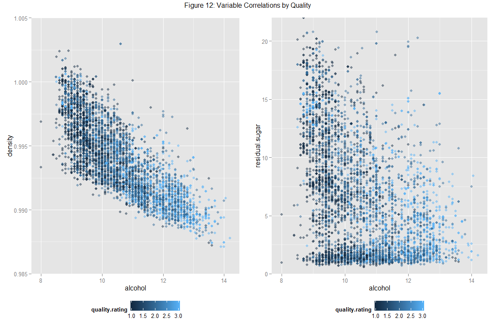 
Once again, the positive correlation between alcohol content and wine quality (0.44) can be observed by the scatterplot color transition moving along the x-axis. However, it is difficult to see any relationship between density or residual sugar and level of perceived wine quality.

Q: Talk about some of the relationships you observed in this part of the investigation. How did the feature(s) of interest vary with other features in the dataset?
A relationship was established between alcohol and wine quality as part of the bivariate analysis. As part of the multivariate analysis, effort was put towards establishing whether those factors which have an identified correlation with alcohol (density and residual sugar), would also demonstrate a relationship with wine quality. Unfortunately, there is no obvious relationship between wine quality and these factors.

Q: Did you observe any interesting relationships between the other features (not the main feature(s) of interest)?
The negative correlation between alcohol and density once again presented itself as part of the multivariate analysis.


###6. Final Plots and Summary
A summary of the key univariate, bivariate and multivariate plots is provided. For this section, some of the plot characteristics were refined, including axis and legend labels.

The wine quality characteristic was investigated as part of the univariate analysis.
 
Revisiting the distribution of wine quality ratings, it is evident that for most wines, the quality score falls between 5 and 6.

As part of the bivariate analysis, a relationship between alcohol and wine quality was found.
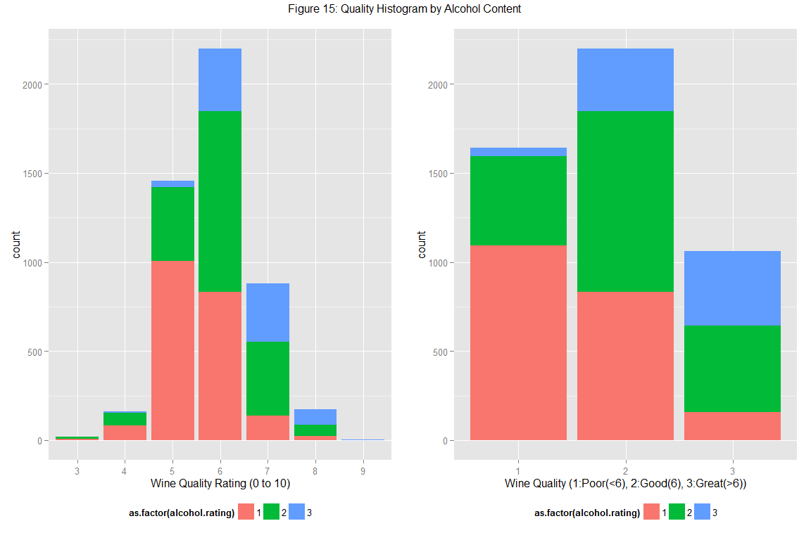 
The above plots show histograms of wine quality ratings, colored by alcohol content. The plot on the left shows the full range of wine quality ratings while the plot on the right shows the categorized quality ratings as discussed earlier. Alcohol content colors are matched to the alcohol content categories: 1:Weak (10% or less), 2:Mild (between 10% and 12%), and 3:Strong (12% or greater). 

The plots show that higher alcohol content wines (10% or greater) have a grater representation in observations with a higher wine quality rating (6 or greater). This is particularly obvious when looking at the right plot which has a much greater amount of higher alcohol content wines falling within the 'Great' wine quality category. 

Finally, as part of the multivariate analysis, the search for factors which effect wine quality was extended to include other chemical properties including density and residual sugar.
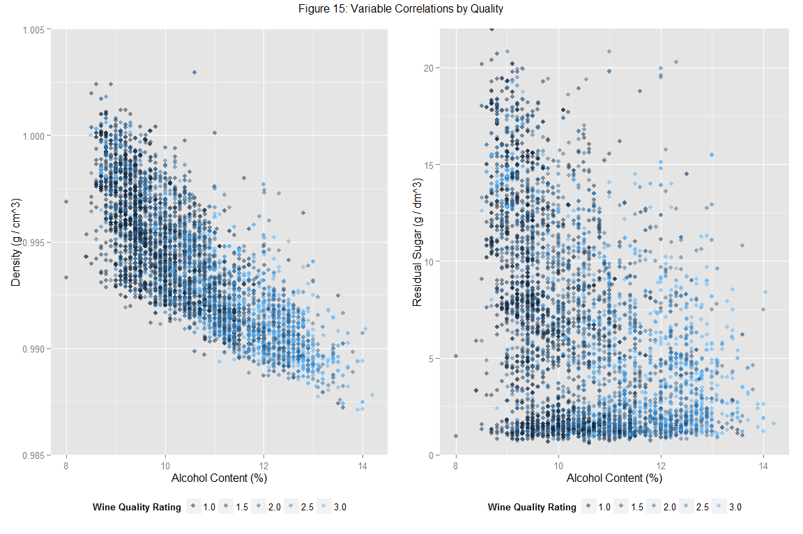 
Although a relationship exists between alcohol and density/residual sugar, these alternative chemical properties show no noticeable relationship to wine quality.


###Reflection
* I found a number of outliers within this dataset. Since this analysis focused on visual representation of data rather than statistical inference, I accounted for these outliers by manually setting plot ranges.

* I initially struggled to see what insights could be gained from this dataset. However, going through each variable systematically as part of the univariate/bivariate analysis helped to narrow in the key data drivers/relationships.

* It does not look like wine quality is well supported by the majority of chemical properties. Although there is a relationship between alcohol content and quality, I struggled to find similar relationships between quality and other chemical variables.

* There is potential to build on this analysis in a number of ways. For example, Udacity provides a reference to a similar dataset related to red wines. I would be interested in identifying the common relationships between the two types of wines. Additionally, there is scope to build a predictor/estimator for perceived wine quality based on the relationships identified as part of this analysis.
